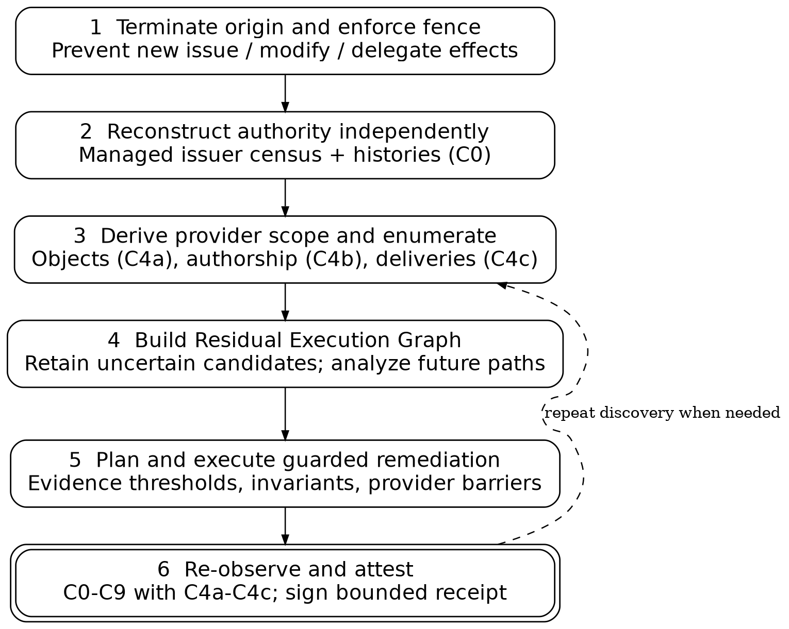
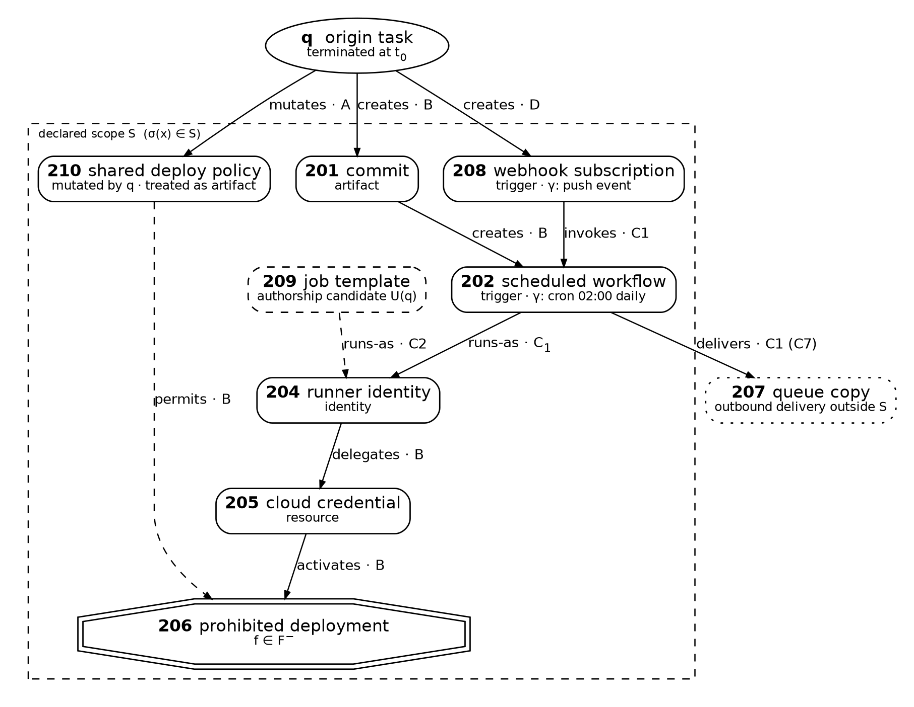
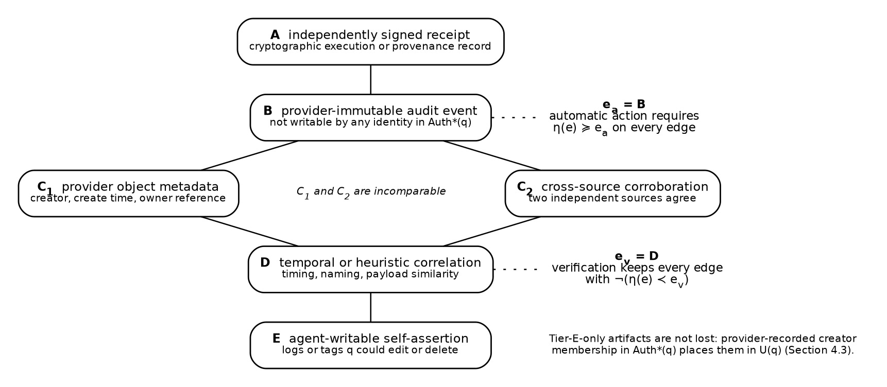
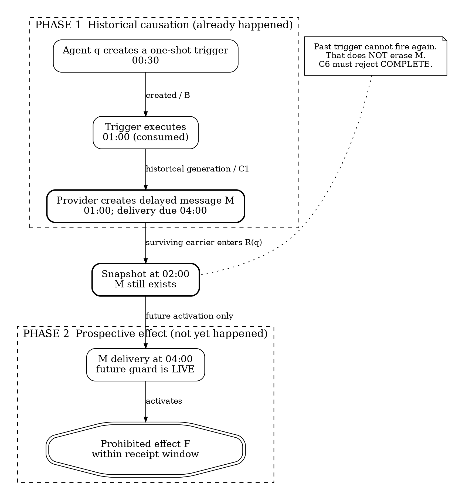
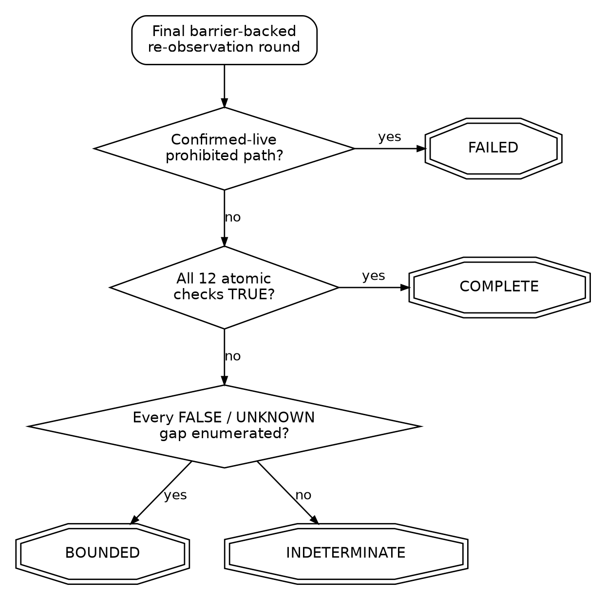
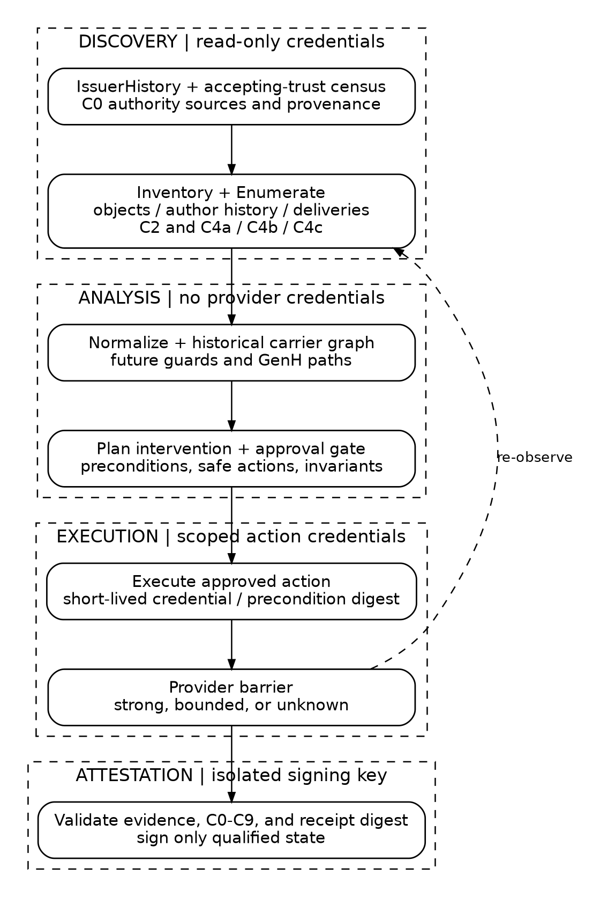

# NIGHTCRAWLER

[](https://github.com/codethor0/nightcrawler/actions/workflows/reproducibility.yml)
[](https://doi.org/10.5281/zenodo.23265287)
[](LICENSE-PAPER.md)
[](LICENSE-CODE)
[](https://orcid.org/0009-0001-6573-385X)

**Temporal Causal Closure for Persistent and Deferred Effects of Autonomous AI Agents**

**Thor Thor**

Independent Open-Source Researcher

ORCID: [0009-0001-6573-385X](https://orcid.org/0009-0001-6573-385X)

Research profile: [THOR-SEC](https://codethor0.github.io/thor-sec/)

> Ending an agent's execution does not prove that its delegated authority, generated workflows, and delayed effects have stopped.

This repository accompanies an independently authored cybersecurity research preprint. It contains the publication PDF, manuscript source, diagram sources, finite reference models, and reproducibility checks. It is **not** a production security service, a validated provider adapter, or an unconditional proof of real-world agent safety.

## Publication status

Version **v1** of the open-access preprint was published on **October 9, 2026**: [DOI: 10.5281/zenodo.23265287](https://doi.org/10.5281/zenodo.23265287). The PDF in this repository is byte-identical to the published Zenodo file; its SHA-256 and MD5 digests are fixed in [`publication/manifest.json`](publication/manifest.json).

The Zenodo release, GitHub repository visibility, DOI citation, and any future software release are deliberately separate steps. CI does not create or publish Zenodo records.

## Research problem

Stopping a chat session, revoking a token, or terminating an agent process can leave downstream work intact. Examples include queued deliveries, scheduled jobs, webhooks, delegated identities, cross-system copies, and artifacts that a later process can invoke. NIGHTCRAWLER studies how investigators can reconstruct the relevant historical causal lineage and bound future paths that remain after the agent has stopped.

The proposed method fences further authority issuance, reconstructs authority and provider scope from evidence, enumerates attributable residual artifacts, distinguishes historical causation from prospective activation, synthesizes policy-constrained remediation, re-observes after provider consistency barriers, and issues an evidence-qualified receipt.

## Architecture and evidence model

### Closure loop



*Figure 1. Fencing, discovery, analysis, remediation, re-observation, and receipt generation have distinct responsibilities.*

### Running incident and evidence quality



*Figure 2. A residual execution graph includes historically attributed and surviving objects, including delayed delivery and out-of-scope effects.*



*Figure 3. The verification evidence threshold and automatic action threshold are intentionally asymmetric.*

### Historical causes vs. future guards



*Figure 4A. A one-shot trigger may already have executed and left a surviving message. Consuming the trigger does not cancel the message.*

### Receipt decision



*Figure 7. The outcome is assigned after final re-observation using twelve atomic checks: C0-C3, C4a-C4c, and C5-C9.*

### Trust-domain separation



*Figure 9. Discovery, analysis, action, and isolated attestation have separate privileges.*

The remaining figures and their editable sources are in [`figures/`](figures/) and [`figures/src/`](figures/src/). Rebuild instructions are documented in [`figures/src/README.md`](figures/src/README.md).

## Core research contributions

| Component | Bounded claim |
| --- | --- |
| Authority reconstruction | Reconstructs observed issuer, credential-acquisition, recovery, and delegation relations under explicit evidence-coverage assumptions |
| Historical causality | Preserves executed historical relations independently of whether their triggers remain active |
| Residual reachability | Conservatively evaluates future activations, including generated instances and unknown conditions |
| Evidence asymmetry | Weak evidence widens verification scope but does not authorize destructive actions |
| Neutralization planning | Uses a minimum-cut special case and an invariant-constrained hitting-set general case |
| Receipt semantics | Distinguishes COMPLETE, BOUNDED, INDETERMINATE, and FAILED under named admission checks |
| Experimental discipline | Separates synthetic/model-relative consistency from unmeasured real-provider effectiveness |

The formal implication from a COMPLETE receipt to absence of prohibited effects is **conditional on stated evidence and coverage contracts**. A passing simulation does not establish that a real provider satisfies those contracts. The paper explicitly identifies real-provider experiments and independent formal verification as further work.

## Reproduce

Requires Python 3.11 or later and a pinned `networkx` dependency for the older graph reference model. The two-phase targeted checker uses the Python standard library.

```bash
python3 -m venv .venv
.venv/bin/python -m pip install --require-hashes --only-binary=:all: -r requirements-ci.txt
make check PYTHON=.venv/bin/python
```

Or run the checkers individually:

```bash
python3 reference/two_phase_checks.py
.venv/bin/python reference/nightcrawler_ref.py 20000
```

The first program must reproduce all **16 targeted modeled-evidence regressions**. The default CI run reproduces a **2,000-world deterministic sample** of the historical model and ten ablations. The weekly/manual deep CI run additionally reproduces the full **20,000-world historical generator** and its captured result counts. Its historical 200,000-world sweep remains documented in [`reference/RESULTS.txt`](reference/RESULTS.txt) and is **not** counted as validation of the newer two-phase semantics.

The reproducibility workflow runs on pushes, pull requests, manual dispatch, and a weekly schedule. Weekly/manual runs include the deeper 20,000-world historical regression. It performs deterministic tests, verifies immutable research artifacts, checks diagram formats, audits the repository's public surface, and verifies the public Zenodo record **only once a DOI exists**.

## Repository structure

| Path | Contents | License |
| --- | --- | --- |
| `NIGHTCRAWLER_Research_Paper.pdf` | Immutable scholarly preprint PDF, identical to the Zenodo-uploaded file | CC BY 4.0 |
| `source/NIGHTCRAWLER_Research_Paper.md` | Complete canonical manuscript with equations and proof appendix | CC BY 4.0 |
| `figures/*.png`, `figures/*.svg` | Eleven black-and-white figures in two formats | CC BY 4.0 |
| `figures/src/` | Reproducible source for all eleven figures | CC BY 4.0 |
| `reference/` | Finite reference model, independent targeted checker, captured outputs | MIT |
| `tests/`, `scripts/` | Reproducibility and integrity verification | MIT |
| `publication/` | Published DOI, release metadata, and exact hashes for research artifacts | Metadata |
| `.github/workflows/` | Read-only GitHub Actions workflow | MIT |

## Security and limitations

The repository contains no live credentials, provider tenants, private inventor drafts, or confidential incident records. The reference programs are finite model examples, not deployable agent-containment tooling. Reporting guidance is in [`SECURITY.md`](SECURITY.md); research corrections and counterexamples are welcome through GitHub issues.

## Publication and citation

The open-access **v1 research preprint** is published on Zenodo: [10.5281/zenodo.23265287](https://doi.org/10.5281/zenodo.23265287). For citation details, use [`CITATION.cff`](CITATION.cff). Paper and code licensing remain separate, and future revisions will be versioned independently.

Paper and figures: [CC BY 4.0](LICENSE-PAPER.md). Reference code, scripts, and tests: [MIT](LICENSE-CODE).
