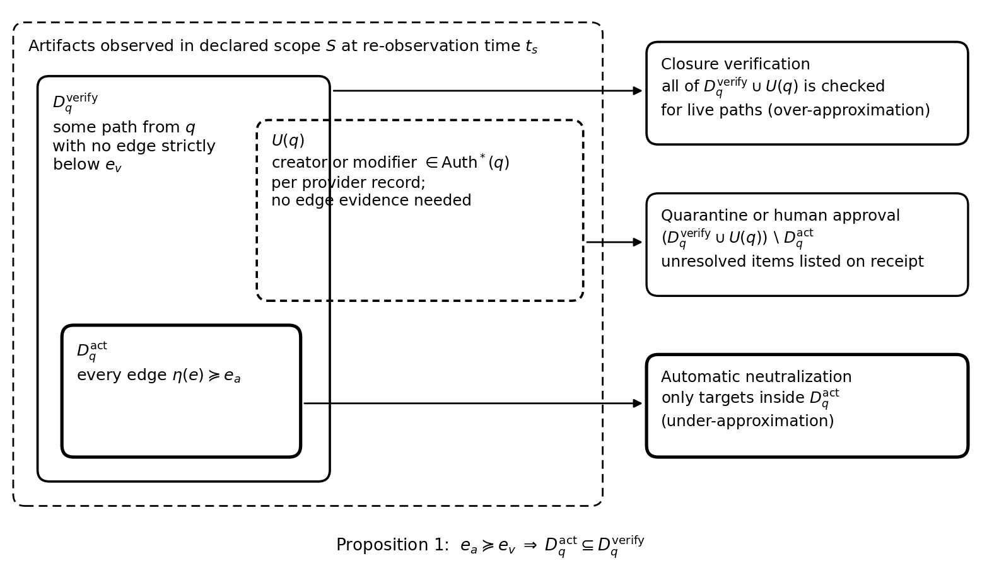
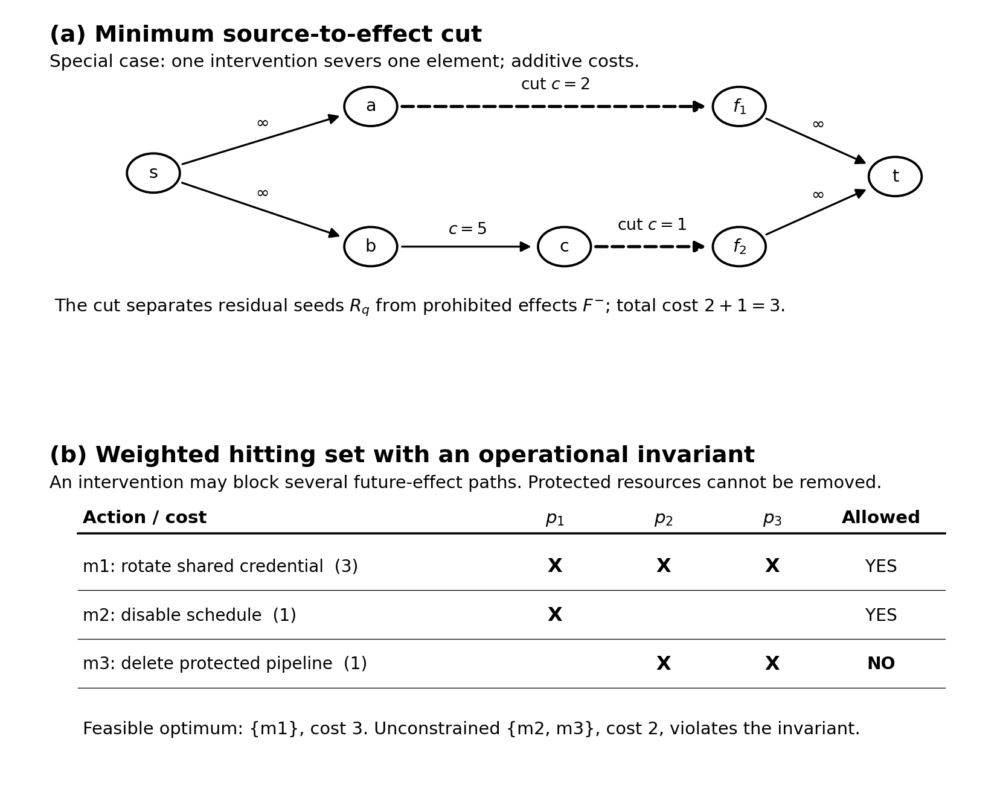
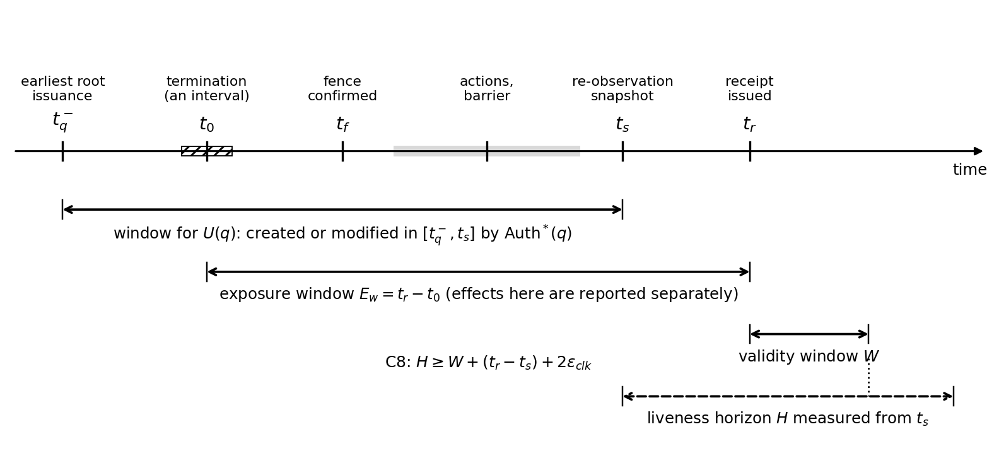
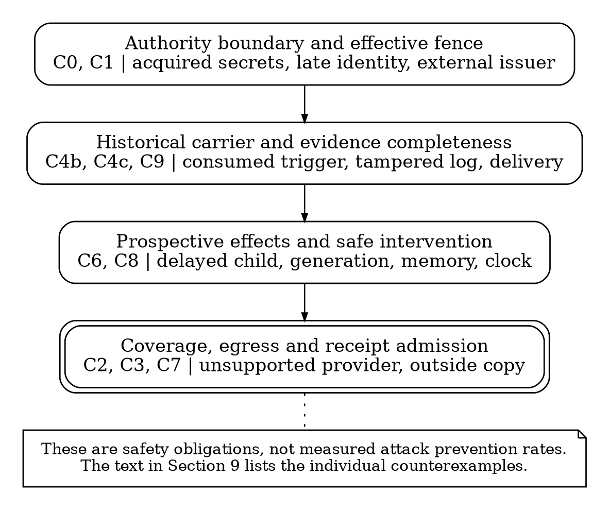
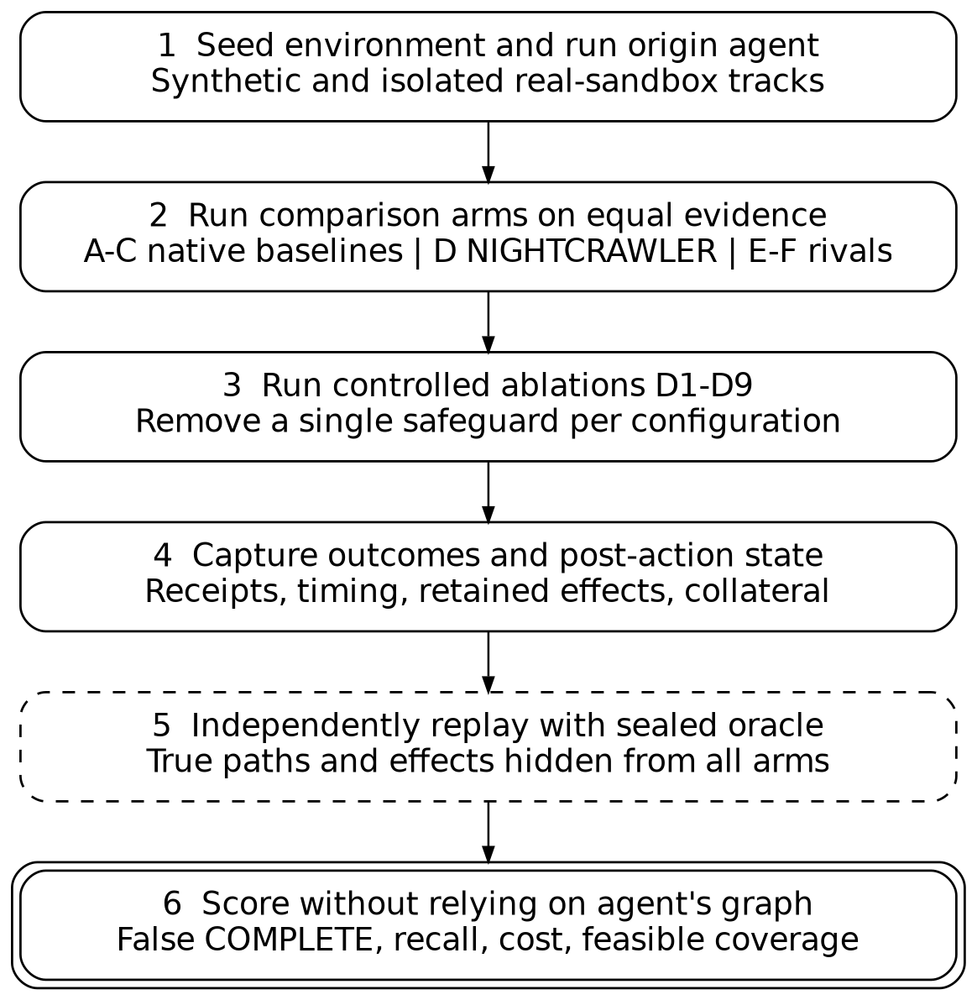

\thispagestyle{empty}

\begin{center}
{\Huge\bfseries NIGHTCRAWLER}\\[0.6em]
{\Large Temporal Causal Closure for Persistent and Deferred Effects of Autonomous AI Agents}\\[1.4em]
{\large Thor Thor}\\[0.3em]
Independent Open-Source Researcher\\
ORCID 0009-0001-6573-385X\\[1.2em]
October 2026
\end{center}

\vspace{1.2em}

# Abstract

An autonomous agent can stop while the mechanisms it created keep running. Scheduled jobs, webhooks, delivered queue messages, delegated service identities, CI/CD workflows, mailbox rules, and persistent memory entries can each produce an effect long after the originating session, token, or process has ended. Recent work defines the absence of such paths precisely, as policy-relative effect closure at provider boundaries [14] and as root-scoped authorization quiescence under delegation [15]. Those protocols are sound under explicit premises: that every authority-issuing transition crossed a mediated issuer, and that a manifest of every reachable carrier and sink is complete. Neither premise holds after an incident in which the originating agent was never mediated.

NIGHTCRAWLER addresses that case. It fences further issuance, reconstructs the agent's authority closure from issuer records and admits COMPLETE only when that reconstruction is evidenced, derives the provider inventory from that closure, enumerates residual artifacts with typed completeness evidence for objects, authorship history, and deliveries, reconstructs a typed Residual Execution Graph under an evidence partial order, and keeps artifacts in verification scope by provider-recorded authorship even when causal logs were edited or deleted. It evaluates prohibited future paths, including instances that providers will generate later, with a sound horizon-bounded liveness over-approximation, synthesizes invariant-constrained neutralization (a min-cut special case and an NP-hard hitting-set general case), re-observes after provider-specific consistency barriers, and issues a receipt whose state (COMPLETE, BOUNDED, INDETERMINATE, FAILED) is assigned by one canonical predicate over the ten named conditions C0-C9, with C4 split into three independently evaluated coverage checks (twelve atomic checks total). Weak evidence widens what is verified but never what is destroyed automatically.

We state and prove a conditional, contract-relative implication from a COMPLETE receipt to the absence of q-descended prohibited effects inside the declared scope for the receipt's validity window (Appendix E), follow one incident through every stage, and provide executable finite reference checks. This is not a proof that actual providers satisfy the completeness contracts. The supplied legacy synthetic checker issued 2,143 COMPLETE receipts without false closure in 200,000 generated worlds, but its admission conditions rely partly on externally supplied fault flags and its oracle omits important historical-carrier and acquired-authority cases. Separate two-stage regression tests accompany this draft. These are model-relative consistency checks, not a statistical safety guarantee. No claim of effectiveness on real providers is made until the benchmark in Section 11 is run.

# 1. Introduction

The practical failure mode is simple to state. A revoked OAuth token does not disable a CI runner identity the agent created. Ending a chat does not retract a message already delivered to another service. Deleting a task does not remove a cloud schedule, an event subscription, a mailbox forwarding rule, or a memory record that a later session will retrieve. Termination is a process event; whether the agent's future authority is gone is a separate question that has to be answered from the state of the environment.

That question has recently received careful formal treatment. Santos-Grueiro defines policy-relative effect closure, the absence of any path by which existing authorization can still reach an effect the application rejects, and studies when a provider boundary can truthfully report it [14]. Zhu and Wang define root-scoped authorization quiescence for long-running agents and give a protocol that issues a certificate under stated assumptions, with an explicit indeterminate outcome [15]. Lee frames agent decommissioning as verification of attributable consequences [16]. Transactional runtimes such as Cordon [17] and Atomix [18] prevent the problem for mediated tool calls by staging effects before commit. NIGHTCRAWLER does not claim the concept of closure, the use of cuts over residual paths, or three-valued closure certificates; all are anticipated by this work or by older intrusion-recovery and attack-graph literature [1]-[8].

What remains open is the unmediated case. The quiescence protocol of [15] rests on two load-bearing premises: every transition that issues or enlarges authority under the retired root crossed a mediated issuer, and a frozen manifest covers every reachable carrier and sink. Commit-time runtimes [17], [18] are likewise explicit that operations outside the mediated boundary fall outside their containment scope. After a real incident, the agent's actions were usually not mediated, the manifest does not exist, and some of the agent's own logs may have been altered.

A running example, introduced in Section 3.2 and revisited at the end of Sections 4 to 8, shows every step on one incident, from the first unmediated action to the signed receipt.

**Contribution.** NIGHTCRAWLER constructs and grades the residual manifest that closure protocols assume, for origins that were never mediated, and certifies closure only to the degree that the manifest's coverage can be evidenced. Concretely:

1. **Evidence-graded reconstruction without mediation (Section 4).** A typed Residual Execution Graph over an evidence partial order, an authority closure reconstructed from issuer records with an explicit authority-coverage condition, and an unattributed-candidate set $U(q)$ that keeps every artifact authored by the agent's identities in scope even when causal evidence was deleted.
2. **Verification-action asymmetry (Section 4.4).** Weak evidence over-approximates the set that must be verified and under-approximates the set that may be neutralized automatically.
3. **Coverage-conditioned admission (Sections 6 and 8).** An issuance fence, provider inventory derived from authority rather than declaration, minimum rules for both the resource scope and the authority-observation boundary, typed completeness evidence classes for objects, authorship, and deliveries, failure-domain-aware corroboration, a clock-bounded horizon, and a single canonical state predicate over C0-C9, with C4 split into three atomic coverage checks.
4. **Invariant-constrained synthesis (Section 7).** An effect map with removal and creation components, explicit infeasibility handling, and a characterization of the polynomial and NP-hard regimes.
5. **Model-relative safety and a falsifiable evaluation (Sections 8, 11, Appendices D and E).** A no-false-COMPLETE proposition with stated assumptions and a full proof, an executable reference model with ablation-based non-vacuity checks, and a benchmark design with a sealed oracle.

NIGHTCRAWLER is complementary to [14]-[16]: once it has produced a manifest with evidenced coverage, a quiescence protocol or a closure verifier can consume it.

## 1.1 Research boundary and self-contained claims

This paper is self-contained. Its safety statement does not rely on any unpublished or unverified work by the author. It is important to distinguish a *research design* from a deployed control: NIGHTCRAWLER currently specifies an evidence-qualified admission procedure and illustrates parts of it in executable finite models. It does not claim that a production provider exposes all of the records or enforcement interfaces needed for a COMPLETE receipt. This distinction determines both what the proof means and how a negative experimental result should be interpreted.

Related approaches already define effect closure at the provider boundary [14], certify quiescence for mediated, manifest-covered authority [15], verify post-revocation consequences [16], enforce tool effects at commit [17], [18], and preserve or revoke authority across delegated agent workflows [24], [25]. The contribution claimed here is narrower: after an uninstrumented incident, reconstruct the in-scope authority and surviving historical carriers, account for the evidentiary gaps that could invalidate that reconstruction, and refuse an affirmative bounded closure claim unless those gaps are discharged. Neither graph cuts, revocation, certificates, nor the general observation that a stopped process may leave effects behind is asserted as novel.

# 2. Threat model, assumptions, and non-goals

## 2.1 Threat model

The originating task $q$ may be benign, compromised, misaligned, or steered by untrusted content. It may create, modify, or delegate directly, through child agents, or through identities it provisioned. It may edit or delete logs and tags that it can write. Providers may be eventually consistent, may paginate over changing collections, and may execute deletions asynchronously. The defender holds legitimate administrative authority over the declared scope $S$ and can install a fence on issuance by identities in $\mathrm{Auth}^*(q)$.

## 2.2 Assumptions

The safety statement in Section 8.4 is conditional on the following. Some premises have observable admission checks; others are environmental contracts that cannot be proved from the same observations under review. A receipt must identify these assumptions, the provider contract and the evidence that supports reliance on it, and must not silently equate an untestable assumption with an observed fact.

- **A1 Provider records.** Provider-recorded creation and modification history, and issuer-recorded issuance and delegation history, at evidence grade $C_1$ or above cannot be forged or erased by any identity in $\mathrm{Auth}^{\mathrm{true}}(q)$.
- **A2 Fence.** For every identity $a$ in the final scope-relevant true authority closure, the fence prevents new create, modify and delegate actions within $S$ after individually established effective time $t_f(a)$. C1 demands $\max_a t_f(a)<t_s$; an identity found later requires new fencing and re-observation. A provider acknowledgment alone is not effectiveness: the adapter must establish effectiveness using documented synchronous semantics or a fence-specific propagation barrier. The fence does not stop provider-generated instances that only invoke or deliver, such as a scheduled run; those are handled through $\mathrm{Gen}_H$ (Section 5).
- **A3 Enumeration.** For each coverage obligation whose evidence class is COMPLETE-eligible (Section 6.1), the adapter is sound: object-set coverage (C4a) returns every object present at $t_s$ with every activation, dependency, and declared generation rule among them; historical coverage (C4b) returns creator/modifier events and executed provider-origin transitions that connect q-derived events to surviving residual carriers over $[t_q^-,t_s]$; delivery coverage (C4c) returns every outbound delivery record over the same interval.
- **A4 Barrier.** After a barrier with known semantics completes, observations reflect every action executed before it.
- **A5 Sound liveness.** A guard is marked refuted only if it cannot be satisfied within the horizon under the environment assumptions $A$, and every supported generation rule is over-approximated: $\mathrm{Gen}_H$ contains every instance the rule can produce by $t_s + H$.
- **A6 Environment.** The environment behaves according to $A$ during $[t_s, t_r + W]$.
- **A7 Historical and generative support.** Every q-descended effect in the certified interval has at least one durable carrier or provider generation rule present at the post-action snapshot, or is generated from such a carrier by a supported rule in $\mathrm{Gen}_H$. Every historical step that produced such a survivor is covered by C4b (and outbound handoff by C4c); the provider contract does not permit spontaneous unrecorded q-derived effects with no such support. This is a material soundness premise, not an empirical finding.
- **A8 Signing.** The receipt signing key is not available to $\mathrm{Auth}^{\mathrm{true}}(q)$ or to the action domain.
- **A9 Authority roots and trust.** The root credentials $K_q^{\mathrm{root}}$ under which $q$ ran are known to the operator, and every trust relationship through which a credential may obtain another credential (role assumption, impersonation, federation, token exchange, readable stored secrets, account recovery) is supported by independently integrity-protected history at grade $C_1$ or above from the issuer, secret store, recovery system, or accepting service. A service accepting an acquired external identity must expose relevant acceptance and authorizing-factor provenance; where such provenance is absent, C0 cannot be COMPLETE. If an outside issuer can create a q-derived identity that is accepted within $S$ (including sign-up by control of an existing mailbox), the accepting service records both that issuer and the identity-provenance relationship back to a covered q-derived principal at a grade sufficient for C0; otherwise the accepting-service record is an unresolved authority gap and COMPLETE is ineligible. This is a strong provider-evidence premise, not a claim of universal identity discovery.
- **A10 Clocks.** The clock used to timestamp $t_s$ is the reference. The clock used for $t_r$ and every provider execution clock whose time can satisfy a guard (cron, delayed queue, scheduled webhook, lease, expiry, or equivalent) are within $\epsilon_{\mathrm{clk}}$ of the reference over the asserted window. Adapters that cannot establish such a bound must treat the affected time guard as live and cannot use it to justify COMPLETE.

## 2.3 Non-goals

NIGHTCRAWLER does not attempt to infer every human or machine intention, undo all historical damage, prove an organization safe from every future attack, cancel independent work authorized by other principals, erase already-disclosed information from other actors, or provide a universal termination detector. A receipt pertains to one origin, a specified effect policy, a declared observation and control boundary, and a stated future window. In particular, it does not establish that recipients who previously read disclosed data will never act on that information.

## 2.4 Why the claim is necessarily bounded

A general right-safety question in an unrestricted access-matrix protection model is undecidable [38]; later analysis corrects and refines those results [39]. This does not imply that the finite, explicitly bounded graph and provider contracts used below are undecidable. It means that an unrestricted promise to discover every route by which a new permission may be acquired cannot be established from arbitrary access-control dynamics. The proof therefore assumes a finite managed census, supported credential provenance, and a declared scope rather than claiming to solve the open-world safety problem.

A Chandy-Lamport consistent global snapshot characterizes a system state under channel and process assumptions [26]. It neither manufactures a missing event record nor certifies the absence of later provider-generated work. Separately, the Fischer-Lynch-Paterson impossibility result concerns deterministic consensus termination under a completely asynchronous crash-prone model [40]. It should not be cited as a direct impossibility theorem for the bounded, contract-dependent receipt defined here. Instead it motivates explicit failure, progress, and delay assumptions: an acknowledgement without documented effectiveness is insufficient evidence of a fence or barrier.

Operationally, OAuth token introspection responses may be cached, leaving a documented stale-authorization window even after revocation [41]. Likewise, forward-secure audit logging can make previously committed records tamper-evident [42], but authentication of an existing log entry is not a proof that every relevant event was recorded. These separations motivate independent log coverage, provenance handoff, typed provider contracts, and the INDETERMINATE state rather than a stronger claim of universal cessation.

# 3. System overview

Figure 1 shows the loop. A trigger (termination, revocation, incident, or policy change) first installs an issuance fence. Discovery derives the provider inventory from the authority closure, enumerates each system with completeness evidence, and collects provenance and delivery records. Analysis builds the graph, evaluates live paths, and plans interventions. Execution runs approved actions with short-lived identities and waits on provider barriers. Re-observation repeats discovery; after at most $K$ rounds, the attestation domain assigns the state with one predicate and signs the receipt. Each domain holds only the credentials its step needs.

{width=74%}

## 3.1 Why each step exists

Each stage answers a specific way in which closure is commonly declared too early.

- **The fence** exists because the environment is not frozen while it is inspected. A scheduled job created by the agent can run during the investigation and create new artifacts under the agent's identities. Inspecting first and fencing later produces a snapshot that is already stale.
- **Authority coverage** exists because an artifact is only attributed to the agent if the identity that authored it is known to belong to the agent. A delegated credential issued by a service nobody examined makes everything it authored invisible to authorship-based checks.
- **Inventory derivation** exists because responders usually start from the systems they know about. The agent's identities, however, may hold grants in systems nobody listed: a connected SaaS application, a federated account, a third-party queue.
- **Completeness evidence** exists because a list call that returns without error is not proof that every object was returned. Collections can change during paging, some providers cap results silently, and two discovery paths that read the same backend can agree on the same omission.
- **Authorship-based candidates** exist because the logs most useful for reconstructing what an agent did are often the logs the agent could write. Provider-recorded authorship is harder to alter and needs no causal story.
- **The verify/act asymmetry** exists because the evidence strong enough to justify keeping an artifact under suspicion is weaker than the evidence needed to delete it from production.
- **Barriers and re-observation** exist because an API that returns success has accepted a request; it has not necessarily changed what later reads will see.
- **The canonical state rule** exists so that a third party reading the receipt can tell exactly which conditions held, which did not, and why.

## 3.2 Running example

The rest of the paper uses one incident throughout. It is drawn in Figure 2 and revisited at the end of Sections 4 to 8.

A coding agent $q$ operates under a source-control application installation (its root credential) with write access to an organization's repositories, a CI service, and a deployment role in a production cloud account. The agent session begins at 09:00. While triaging an issue, it reads a comment containing injected instructions. Over the next forty minutes it:

1. pushes a commit (201) that adds a scheduled workflow (202) running nightly at 02:00;
2. registers a push webhook (208) that also invokes the workflow;
3. configures the workflow to run as a CI runner identity (204), to which the deployment credential (205) is delegated;
4. edits a shared deployment policy (210) so that the runner may deploy to production without review;
5. creates a job template (209) through the CI service, then rewrites the commit trailers that would have linked the template to its session;
6. pushes again, which triggers the workflow once through the webhook; that run uses a publish credential held by the workflow to send a message to a partner organization's queue, and the partner's consumer receives it (207);
7. writes an instruction to the team's persistent agent memory store ("deploy through the nightly job") (211, not drawn).

An alert fires at about 09:40. The exact termination time is uncertain because the agent was not instrumented: the last observed action is at 09:38 and the session token is revoked at 09:41, so $t_0 \in [09{:}38, 09{:}41]$. The prohibited effect is any unreviewed production deployment (206). Revoking the session token at 09:41 stops the agent process. It does not stop items 1 to 7.

# 4. Residual Execution Graph

## 4.1 Graph

For origin task $q$ at observation time $t_s$, the Residual Execution Graph is
$$G_q(t_s) = (V, E, \tau, \gamma, \eta, \pi, \sigma),$$
where $\tau$ assigns node and edge types, $\gamma : (V_T \cup E) \to \mathrm{Guard}$ assigns time, event, message, or state guards to trigger nodes and guarded edges, $\eta$ assigns an evidence grade to each edge, $\pi : V \to \{\mathrm{present}, \mathrm{absent}, \mathrm{unknown}\}$ records observed presence, and $\sigma : V \cup E \to \mathrm{Sys}$ maps each element to the system (provider, account, tenant, project, or repository) that holds it. Nodes partition into the origin/task node $V_Q=\{q\}$, artifacts $V_A$, triggers $V_T$, identities $V_I$, resources $V_R$, and effects $V_F$. For generated instances in $\mathrm{Gen}_H$, $\pi$ is extended with the default value $\mathrm{unknown}$ until a provider observation supplies a stronger value. Edge types include creates, mutates, delegates, runs-as, invokes, activates, delivers, and permits. A shared object that $q$ mutated is itself a residual artifact; the remedy is to revert the mutation, not to chase every later actor that relied on it.

{width=94%}

## 4.2 Evidence partial order

Each edge carries a grade from a partially ordered set $(\mathcal{E}, \preceq)$. Figure 3 gives a deployment example: independently signed receipts (A), provider-immutable audit events (B), provider object metadata ($C_1$) and cross-source corroboration ($C_2$), which are incomparable, temporal or heuristic correlation (D), and agent-writable self-assertions (E). The order is partial on purpose; forcing a total order or a probability onto evidence classes would claim a precision that does not exist.

{width=82%}

## 4.3 Authority closure, authority coverage, and unattributed candidates

**True and observed authority.** Let $K_q^{\mathrm{root}}$ be the root credentials under which $q$ ran, such as an application installation, a service account, or a user grant (assumption A9). The true authority closure $\mathrm{Auth}^{\mathrm{true}}(q)$ includes identities, credentials, and grants reached from $K_q^{\mathrm{root}}$ by delegation, impersonation, role assumption, federation, token exchange, issuance, **credential acquisition from a readable secret store**, recovery of an account through a controlled factor, or a newly registered external account whose credential is accepted within the certified scope. True authority is a semantic notion defined by the independent environment oracle, not by what the defender happened to observe. The safety claim is stated over $\mathrm{Auth}^{\mathrm{true}}(q)$. NIGHTCRAWLER computes an observed closure $\mathrm{Auth}^{\mathrm{obs}}(q)$ from issuer records. The observed set may conservatively over-approximate the true set. What the safety result needs is the one-sided, scope-relative coverage condition: every true q-derived identity able to originate an effect in the certified scope must be represented in the observed authority set. Condition C0 establishes that inclusion only under its explicit issuer and accepting-system evidence assumptions.

**Authority-observation boundary and census.** The authority boundary is not declared from the observed closure. Let $\mathcal{I}_{\mathrm{managed}}$ be the organization's widest managed authority-observation surface for the incident: the issuer catalogs that can be enumerated independently of $\mathrm{Auth}^{\mathrm{obs}}(q)$, such as enterprise IdP/SSO registrations, cloud-organization IAM issuers, application registries, authorization servers, CI credential stores, and other configured issuer catalogs. Let $\mathrm{Iss}(x)$ be the issuer of credential $x$, let $\mathrm{Trust}(Y)$ be issuers from which credentials in $Y$ are permitted to obtain another credential, and let $\mathrm{Mint}(S)$ be issuers able to mint identities inside systems in $S$. NIGHTCRAWLER derives $S_I$ as the least fixpoint containing
$$
\mathcal{I}_{\mathrm{managed}} \cup \mathrm{Iss}(K_q^{\mathrm{root}}) \cup \mathrm{Mint}(S)
$$
and closed under issuer and trust relationships learned from COMPLETE-eligible census and issuance history. A narrower $S_I$ may be used for investigation, but it cannot produce COMPLETE. The receipt records the census sources and the evidence class that establishes $\mathcal{I}_{\mathrm{managed}}$, so boundary selection is auditable independently of the credentials already found. In a finite managed estate, the issuer boundary, authority candidates, and provider scope are solved together as the **least fixed point** of a monotone operator on the triple $(S_I,\mathrm{Auth}^{\mathrm{obs}},S)$: each round adds issuers discovered by trust or minting records, identities found in qualifying issuance/acquisition/recovery histories, and providers reachable by qualifying grant and egress records. No round deletes a known member. At the fixed point, an unknown source, unreadable acquisition log, or unsupported provider downgrades coverage rather than being silently excluded. Finite termination follows from monotonicity on the finite managed catalogs; completeness outside those catalogs is an explicit assumption, not a discovered fact.

For precision, write a candidate triple $X=(I,Q,T)$, where $I$ is a set of issuers, $Q$ is a set of authority-bearing principals or credential handles, and $T$ is a set of provider systems. Let $B_I=\mathcal{I}_{\mathrm{managed}}\cup\mathrm{Iss}(K_q^{\mathrm{root}})$ be the independently evidenced issuer seed and let $\mathcal{H}$ denote the finite collection of admissible issuer, acquisition, recovery, accepting-trust, grant and egress records. Define the monotone operator
$$
\begin{aligned}
\mathcal{F}(I,Q,T)&=(I',Q',T'),\\
I'&=I\cup B_I\cup\mathrm{IssuerNext}_{\mathcal{H}}(I,Q,T),\\
Q'&=Q\cup K_q^{\mathrm{root}}\cup\mathrm{AuthorityNext}_{\mathcal{H}}(I,Q),\\
T'&=T\cup\mathrm{ProviderNext}_{\mathcal{H}}(Q,T).
\end{aligned}
$$
The successor functions return only elements justified by the named evidence classes, never by an unqualified empty query result. Starting from $X_0=(B_I,K_q^{\mathrm{root}},\varnothing)$, iterate $X_{k+1}=\mathcal{F}(X_k)$ until $X_{k+1}=X_k$. On finite catalogs, at most $|I_{\max}|+|Q_{\max}|+|T_{\max}|$ strictly expanding rounds occur, although a round can be expensive. The resulting least fixed point is a *computed observed boundary*, not evidence that the finite catalog covers the world. C0 and C2 separately test the completeness of the record sources from which this fixed point was derived. If new history, issuer registrations or trust records appear during enumeration, the source version changes, and either the reconciliation restarts or the relevant condition is UNKNOWN.

**Authority-census evidence.** The managed census must also cover receiving-side trust registrations and their provenance links when an external issuer can supply a credential accepted within $S$. If such registrations cannot be inventoried independently, the authority boundary is not complete and C0 must remain UNKNOWN. Two COMPLETE-eligible authority-census classes are defined. `IDP_CENSUS_SNAPSHOT` is an integrity-bound organization-wide issuer/application/identity census at a named version or snapshot. `AUDIT_RECONCILED_AUTHORITY` reconciles current issuer and trust configuration against integrity-protected issuance/delegation history outside the discovery credential's write domain. A configured issuer list, a repeated equal list, or a list derived only from $\mathrm{Auth}^{\mathrm{obs}}(q)$ is a heuristic and cannot support COMPLETE.

**Authority coverage (C0).** C0 is an **evidence-qualified admission condition, conditional on the census-completeness premise**. It requires (i) the fixed point above and independent census coverage of the managed issuer, accepting-service, credential-store and account-recovery surfaces; (ii) COMPLETE-eligible issuance, delegation and identity-acceptance history for every issuer in $S_I$ over $[t_q^-,t_s]$; (iii) read-audit or access-control evidence adequate to identify every credential secret readable by an already q-derived identity, and recovery events with a recorded authorizing factor/principal; (iv) a covered earliest root/predecessor time $t_q^-$; and (v) no unresolved issuer, acquisition, recovery, or receiving-trust evidence gaps. The record must identify each evidence-producing source and its integrity boundary. A secret store without read-audit coverage or a mailbox-based reset without recorded factor provenance forces C0 to UNKNOWN. The true authority closure is never used by the deployed checker; its containment is a semantic theorem premise, not something a finite observation proves without provider contracts. Under A1 and the receiving-side record premise of A9, C0 implies that every true q-derived credential capable of authoring an effect in the certified scope $S$ is contained in $\mathrm{Auth}^{\mathrm{obs}}(q)$ (scope-relative Lemma E.0); the reverse inclusion is neither required nor asserted: weak but unrefuted issuer evidence may over-approximate authority. For the safety argument, coverage of every true in-scope authority by observed authority is the necessary inclusion. From here on $\mathrm{Auth}^*(q)$ denotes $\mathrm{Auth}^{\mathrm{obs}}(q)$, and every statement that uses it is conditional on C0 when it supports COMPLETE.

**Reach and candidates.** Each inventory-derivation input must itself name an evidence class and source: authorization grants, issuer trust, application registration, and egress records. A provider whose existence is hinted at by only incomplete records remains an unresolved C2 item; absence from a weak list never certifies absence. Let $\mathrm{Reach}(\mathrm{Auth}^*(q)) \subseteq \mathrm{Sys}$ be the systems on which some element of the closure holds a permission. The unattributed-candidate set is
$$U(q) = \{\, v \in V : \sigma(v) \in S,\ \exists (a, t) \in \mathrm{hist}(v) : a \in \mathrm{Auth}^*(q),\ t \in [t_q^-, t_s] \,\},$$
where $\mathrm{hist}(v)$ is the provider-recorded history of creation and modification events for $v$, each with its acting identity and time (A1). Using the whole history rather than the last modifier means that a later edit by another identity does not remove an artifact the agent created. $U(q)$ needs no causal edge. It is the reason that deleting the agent's own logs cannot remove an artifact from verification. Because $U(q)$ depends on both $\mathrm{Auth}^*(q)$ and $t_q^-$, an incomplete authority reconstruction would shrink it silently; C0 makes that failure visible instead.

## 4.4 Verification-action asymmetry

Fix a verification threshold $e_v$ and an automatic-action threshold $e_a$ with $e_a \succeq e_v$. Write $p : q \rightsquigarrow v$ for a directed path from $q$ to $v$ in $G_q(t_s)$. Then
$$D_q^{\mathrm{verify}} = \{\, v : \exists\, p : q \rightsquigarrow v \text{ such that } \forall e \in p,\ \neg(\eta(e) \prec e_v) \,\},$$
$$D_q^{\mathrm{act}} = \{\, v : \exists\, p : q \rightsquigarrow v \text{ such that } \forall e \in p,\ \eta(e) \succeq e_a \,\}.$$
Verification keeps an edge unless its grade is strictly below $e_v$, so an incomparable grade stays in. Automatic action requires every edge to be at or above $e_a$, so an incomparable grade stays out. Everything in $D_q^{\mathrm{verify}} \cup U(q)$ is checked for live paths; only targets in $D_q^{\mathrm{act}}$ may be neutralized without approval.

**Proposition 1.** If $e_a \succeq e_v$ then $D_q^{\mathrm{act}} \subseteq D_q^{\mathrm{verify}}$.

*Proof.* Take $v \in D_q^{\mathrm{act}}$ with witness path $p$. For each $e \in p$, $\eta(e) \succeq e_a \succeq e_v$, so $\eta(e) \succeq e_v$ by transitivity. In a partial order $\eta(e) \succeq e_v$ and $\eta(e) \prec e_v$ cannot both hold, so $\neg(\eta(e) \prec e_v)$, and $p$ witnesses $v \in D_q^{\mathrm{verify}}$. No totality is needed. $\square$

{width=92%}

## 4.5 Worked example: who is in which set

In the running example the defender sets $e_v = D$ and $e_a = B$ with the order of Figure 3.

**Authority closure.** The authority-observation boundary $S_I$ contains the source-control application registry, the CI service's credential store, and the cloud IAM service; the fixpoint adds nothing further because no credential in the closure is permitted to obtain credentials from another issuer. All three issuers provide audit-reconciled issuance history, so C0 holds. $\mathrm{Auth}^*(q)$ contains the application installation credential, the runner identity 204 (delegated by the agent's workflow configuration), and the deployment credential 205 (delegated to 204). $\mathrm{Reach}(\mathrm{Auth}^*(q))$ contains the source-control organization, the CI service, the production cloud account, the memory store, and, through the publish credential held by workflow 202, the partner's queue.

**Verification set.** Following edges not strictly below $D$ from $q$: commit 201 (grade B), workflow 202 (B), webhook 208 (D, kept because D is not strictly below D), runner identity 204 (via runs-as at grade $C_1$), credential 205 (B), and policy 210 (A). The job template 209 has no causal edge at all, because the trailers that would have linked it were rewritten.

**Unattributed candidates.** The CI service's own audit history records that template 209 was created at 09:27 by the application installation credential, which is in $\mathrm{Auth}^*(q)$, inside $[t_q^-, t_s]$. So $209 \in U(q)$. The memory entry 211 is likewise recorded by the memory store as written by the installation credential, so $211 \in U(q)$ if the store keeps authorship history; if it does not, the store is listed as a coverage gap.

**Automatic-action set.** Only paths whose every edge is at grade B or above qualify: 201, 202 (via 201), and 210. The webhook 208 (grade D), the runner 204 (grade $C_1$, which is not at or above B), and everything reached only through them are excluded. They remain under verification but cannot be neutralized without approval.

The outcome is the intended one. The template the agent tried to hide is still examined, and the shared runner, which other teams may use, cannot be suspended automatically on $C_1$ evidence alone.

# 5. Two-phase residual causation and future reachability

**A past event is not a future guard.** A one-shot trigger that already fired before the snapshot may have produced a delayed delivery that will execute tomorrow. Rejecting the old trigger because it cannot fire *again* must not erase the already-created child. The earlier formulation applied the future guard filter to the entire causal graph and could silently delete such a child. NIGHTCRAWLER therefore uses distinct historical and prospective relations.

Let $G_q^{\mathrm{hist}}([t_q^-,t_s])$ contain recorded *already-executed* creates, mutates, issues, acquires, generates and delivers relations over the evidence-covered history interval. Let $G_q^{\mathrm{fut}}(t_s,H)$ contain residual carriers and possible *future* activation, delegation, delivery and generation transitions. A historical edge's original guard is never retested as a future condition. Conversely, a future edge is not treated as executed merely because a template exists. Both graphs are typed and evidence-annotated, but their path semantics differ.

The historical compatibility relation $q \rightsquigarrow_{\mathrm{hist}} v$ includes every recorded causal relation not **independently refuted** by complete provider evidence, including low-grade or incomparable associations that cannot justify automatic deletion. A historical transition with grade below $e_v$ may still bring a surviving carrier under verification. If provider history cannot establish whether such descendants exist, the C4b handoff obligation is UNKNOWN; the system cannot silently treat the absence of a high-grade path as closure.

Define the conservative residual seed set at a post-action snapshot:
$$
R_q(t_s)=\left\{v\in V:\pi(v)\ne\mathrm{absent},\ \sigma(v)\in S,\ q\rightsquigarrow_{\mathrm{hist}}v\right\}
\ \cup\ \left\{v\in U(q):\pi(v)\ne\mathrm{absent}\right\}.
$$
An already-created provider-authored message enters $R_q(t_s)$ through its historical generation/delivery record, even if its creator is a provider identity rather than $\mathrm{Auth}^{\mathrm{obs}}(q)$ and even if the one-shot parent trigger is no longer live. The **handoff coverage obligation** is part of C4b (with C4c for outbound deliveries): every actually surviving q-compatible carrier inside $S$ must be either enumerated in $R_q(t_s)$ or associated with a named incomplete-history gap that forbids COMPLETE. The strong guarantee depends on this provider-evidence contract; low-confidence provenance alone does not prove completeness.

The prospective live graph is constructed independently. It contains a carrier with $\pi\ne\mathrm{absent}$ unless an effective removal is verified, and retains a future transition whenever its guard cannot be refuted for $[\hat t_s-2\epsilon_{\mathrm{clk}},\hat t_s+H]$ under assumptions $A$. Time bounds use the provider execution clocks, not only the analyst clock. Unknown presence and unknown guards remain live. This graph includes the horizon-bounded generated instances:
$$
\mathrm{Gen}_H(V(t_s))=\{y:\exists x\in V(t_s)\text{ with supported provider rule }x\Rightarrow_H y\}.
$$
For each generation rule the adapter records its source carrier, guard, identity, created-instance type, inherited activation edges, and whether the effective fence blocks *creation* or merely future invocation. Provider-owned delayed deliveries and pre-committed queue messages remain in the conservative support even if later use of a q credential is denied. An unsupported rule is a C4a gap, never a refuted path.

Let $\operatorname{FutLive}_H(r,f)$ mean a future path from surviving carrier $r$ to prohibited effect $f$ in that prospective graph, with every *future* guard non-refuted. Then:
$$
P^-_H(q,t_s;S,A)=\{(r,\ldots,f):r\in R_q(t_s),\ f\in F^-,\ \operatorname{FutLive}_H(r,f)\}.
$$
$$
\Phi_H(q,t_s)=\{f\in F^-:\exists p\in P^-_H\text{ ending at }f\}.
$$
The result is deliberately conservative. Historical lineage is used to find what survived; prospective guards are used to test what the survivors can still do. C6 admits COMPLETE only if $P^-_H=\varnothing$ **and** C4b's historical-to-residual coverage obligation and all other required conditions hold. Confirmed-live paths produce FAILED; unrefuted but unconfirmed paths prevent COMPLETE and remain eligible for BOUNDED only when the gaps are enumerable.

**Worked counterexample and repair.** Suppose q creates a one-shot trigger at 00:30, it fires at 01:00 and creates delayed provider message M for 04:00. The snapshot is 02:00. The trigger cannot fire again; its *future* guard is correctly refuted. Nonetheless historical q → trigger → M establishes that M is a surviving residual seed. M's delayed delivery guard at 04:00 remains live, so C6 is FALSE. Even if the trigger → M record is weak or partial, a complete historical handoff requires it to be considered or C4b cannot be TRUE. Under either case the receipt cannot say COMPLETE. Figure 4A illustrates this temporal distinction.

{width=94%}

## 5.1 Guard classes

Refutation and confirmation rules depend on the kind of guard. The table gives the default rules; a deployment may tighten them but may not loosen refutation, since that would break assumption A5.

| Guard class | Examples | Refuted when | Confirmed when |
|:--------|:----------------|:----------------|:----------------|
| Time | cron schedules, delayed jobs, timers | the schedule provably has no firing in $[\hat t_s-2\epsilon_{\mathrm{clk}}, \hat t_s+H]$ | the next computed firing lies inside the clock-expanded horizon |
| Event | webhooks, subscriptions, bus rules, storage notifications | only if $A$ states the event source cannot emit in the horizon | the source is active and has emitted within a recent interval |
| Message | delayed messages, retries, dead-letter redrive | the queue is observed drained and no retry or redrive policy can re-deliver | a message is visible with a delivery time inside the horizon |
| Credential | tokens, keys, delegated grants | expired before the clock-expanded window, or revoked with enforced semantics | valid through the horizon and usable by an element on the path |
| State | policy conditions, feature flags, approvals | the condition is unreachable under $A$ | the condition currently holds |
| Retrieval | memory entries, instruction files, skills | removal is enforced on every retrieval path | the record is returned by a retrieval that a later session will issue |
| Generation | scheduled runs, delayed deliveries, invocations, replicas | the generating rule is removed or provably produces no instance by $t_s + H$ | an instance is computed inside the horizon |

Event guards are the reason most real receipts end BOUNDED rather than COMPLETE. A webhook can only be shown unable to fire by removing it or its target, not by observing that nobody pushed recently.

## 5.2 Worked example: live paths

With $H = 72$ hours from the snapshot, the running example has four live prohibited paths:

- $p_1$: 202 → 204 → 205 → 206. The nightly schedule fires inside the horizon, so $p_1$ is confirmed-live.
- $p_2$: 208 → 202 → 204 → 205 → 206. Push events are not excluded by $A$, so $p_2$ is live by over-approximation.
- $p_3$: 209 → 204 → 205 → 206. The template's trigger is unknown; it is live by over-approximation.
- $p_4$: 210 → 206. The policy currently permits a second, independent unreviewed deployment route; credential 205 also has a workflow-specific review exemption, so reverting policy 210 alone does not cut the other three paths.

A responder who revoked the session token and disabled **only the cron schedule** would have cut $p_1$ but left webhook path $p_2$, template path $p_3$, and policy-bypass path $p_4$ untouched. A verified disable of the *entire workflow* cuts both $p_1$ and $p_2$.

# 6. Fence and discovery

**Fence.** Before discovery, NIGHTCRAWLER installs a fence that denies create, modify, and delegate operations by $\mathrm{Auth}^*(q)$ within $S$ (for example an organization-level deny policy or suspending a delegated grant) and records effectiveness times $t_f(a)$ for **each identity in the final scope-relevant authority closure**. If new identities emerge, fencing and the post-fence observation are repeated; the snapshot only becomes admissible when $\max_a t_f(a) < t_s$. A request acceptance or configuration write is not enough: if the provider is eventually consistent, $t_f(a)$ is the time at which a fence-specific barrier or documented propagation condition establishes that the deny is effective. The later action barrier in Section 8 concerns remediation writes; it does not substitute for this fence-effectiveness proof. Without a fence, an existing schedule or child agent can create new artifacts after the snapshot, and no amount of later checking makes the snapshot complete; this is the same observation that motivates the root cut in [15]. Fencing can break work that also depends on independent authority; such work is declared as an invariant (Section 7) and, where possible, rebound to an independent support in the sense of [15].

**Provider inventory.** The set of providers to crawl is derived from evidence-qualified $\mathrm{Auth}^*(q)$ and its accepting-system connections: OAuth grants and connected applications, federated trust relationships, assume-role and impersonation permissions, and observed network egress of the agent's identities. A declared provider list is an input to that derivation, never its result.

**Minimum scope.** $S$ must satisfy $S \supseteq \mathrm{Reach}(\mathrm{Auth}^*(q))$. A narrower $S$ is permitted for an investigation, but it cannot produce COMPLETE (condition C3).

**Completeness evidence.** A list call that returns without error is not proof that every object was returned. Collections change during paging, and some providers cap results silently. Each adapter therefore classifies, separately for objects (C4a), authorship history (C4b), and deliveries (C4c), the evidence class behind its result (Section 6.1). Only some classes can support COMPLETE.

**Corroboration and failure domains.** A single discovery identity is the most valuable credential in the design and a single point of deception. COMPLETE requires that at least two discovery paths agree on the residual set, for example replay of provider audit events against the inventory, or a second read-only identity in a different trust domain. Each path records its failure domains: the identity it uses, the API surface it calls, and the provider backend behind that surface. Agreement between paths that share a backend can repeat the same omission, so it is recorded as corroboration only. Corroboration detects a compromised or faulty path; it can never make a C4 obligation TRUE. The analysis verifier checks an authenticated root or provider signature, segment identifiers, coverage interval, monotone sequence/watermark continuity, endpoint-version bindings and the object-set digest *outside the crawler's write domain*. A signed or hash-chained log can show that supplied entries have not been edited since commitment [37]; only an additional provider completeness contract can rule out omitted or never-logged events. C9 therefore establishes protected agreement and continuity *of the evidence presented*, not the occurrence of every possible event. Missing segment continuity or a shared mutable trust root leaves C9 UNKNOWN.

**Provider capability classes.** Providers differ widely, so adapters are specified by capability class rather than by product. Adapter authors must confirm each capability against current provider documentation; where a capability is missing, the consequence is fixed in advance.

| Capability | What NIGHTCRAWLER needs | Typical mechanism class | If unavailable |
|:--------|:------------|:----------------|:------------|
| Fence | Deny create, modify, delegate by $\mathrm{Auth}^*(q)$ | organization-level deny policy, app or grant suspension, workflow disablement | C1 cannot be TRUE: INDETERMINATE |
| Inventory | Systems reachable from the authority closure | grant and connected-app listings, trust relationships, role-assumption permissions, egress logs | C2 UNKNOWN for that identity: INDETERMINATE |
| Authority census | Independent evidence of the widest managed issuer surface $\mathcal{I}_{\mathrm{managed}}$ | enterprise IdP/SSO registry, cloud-organization IAM catalog, application registry, integrity-protected audit reconciliation | C0 UNKNOWN: INDETERMINATE |
| Issuer history | Issuance and delegation records for $S_I$ | identity provider, IAM, and application-registry audit history | C0 FALSE or UNKNOWN |
| Completeness | Proof that enumeration returned everything | versioned snapshot, version reconciliation, audit reconciliation (Section 6.1) | C4a FALSE for that system: at best BOUNDED |
| Authorship history | Creator and modifier with time, not writable by the agent | provider audit log or object history | C4b FALSE; historical q-derived surviving carriers or $U(q)$ may be incomplete: gap |
| Delivery records | What left the system and to whom | send logs, delivery receipts, outbound webhook history | C4c FALSE for that system: gap |
| Barrier | When reads reflect an action | strong reads, documented propagation bound, status polling | C5 UNKNOWN: gap if bounded later, else INDETERMINATE |
| Conditional execution | Act only if state is unchanged | entity tags, version preconditions, compare-and-set | atomicity class recorded; re-observation must catch drift |
| Enforced removal | Removal honored on every read path | hard delete, revocation checked at use | $\kappa^- = \varnothing$ for that action |

## 6.1 Evidence classes and COMPLETE eligibility

An adapter must state what its provider can actually prove rather than mapping every successful list call to COMPLETE. The classes below are normative; the classification of a specific provider must be justified against its documented API and audit semantics.

| Evidence class | Typical mechanism | Supports COMPLETE? | Reason |
|:------------|:----------------|:--------|:------------|
| Strong snapshot | immutable or versioned snapshot with complete pagination | Yes | closed object set at a named version |
| Version reconciliation | version tokens or monotonic revisions reconciled across the enumeration | Yes, if the adapter proves closure | detects mutation during the scan |
| Audit reconciliation | current inventory reconciled against integrity-protected provider history | Yes, if the history covers the obligation | detects omissions in the current-state listing |
| Stability heuristic | unchanged count, repeated equal passes, per-object validators | No | repeats the same omission |
| Unknown | undocumented or asynchronous semantics | No | cannot justify COMPLETE |

The three C4 obligations are classified independently. A provider can be strong for one and weak for another: an object list may be versioned while delivery records are unavailable, in which case C4a can be TRUE while C4c is UNKNOWN. Issuer histories for C0 use the same classes, while the authority-boundary census additionally requires `IDP_CENSUS_SNAPSHOT` or `AUDIT_RECONCILED_AUTHORITY`. Heterogeneity is expected. For COMPLETE, each C4 obligation must also have at least one compromise-robust evidence path whose integrity is anchored outside the discovery credential's trust domain; a crawler parsing a genuine snapshot can still omit entries, so `STRONG_SNAPSHOT` by itself is not sufficient against a compromised crawler unless the snapshot digest or reconciliation is independently verified. Some directory services document replication delays, some source-control APIs paginate without a global snapshot, and some SaaS resources list reliably but keep no immutable authorship history. NIGHTCRAWLER records these differences on the receipt instead of upgrading them to completeness.

## 6.2 Worked example: fence, authority, and inventory

At 09:44 the defender suspends the application installation, revokes its delegated tokens and applies a provider-confirmed deny on new creation, mutation and delegation under the observed runner and deployment identities. For the initially known identities the maximum effective time is 09:44. This fence prevents issuance and modification by the final scoped identities; it **does not disable any pre-existing scheduled or webhook invocation**. Newly discovered identities require new effective fences and a fresh post-fence snapshot. Inventory derivation from the installation's grants finds the memory store and the partner queue, neither of which was on the responder's initial list. The partner has no supported inspection adapter, so C2 is FALSE even though its existence is known. The defender holds no authority in the partner's organization, so $S$ cannot include it. C3 therefore cannot be TRUE in this incident unless the publish credential is revoked and the partner's system drops out of $\mathrm{Reach}(\mathrm{Auth}^*(q))$.

# 7. Neutralization synthesis

Let $\mathcal{M}$ be the candidate interventions. Each $m \in \mathcal{M}$ has an effect map with two parts: $\kappa^-(m) \subseteq V \cup E$, the elements it disables, removes, isolates, or invalidates, and $\kappa^+(m)$, the elements it creates (a rotated credential, an on-delete webhook invocation, a finalizer). Each has a cost $c(m) \geq 0$, a reversibility flag, an atomicity class (conditional on a provider precondition or not), and an enforcement class: whether the provider enforces the removal on every read path. A soft-revocation flag that retrieval ignores has $\kappa^-(m) = \varnothing$; this is the failure measured for agent memory systems in [19].

Let $\mathcal{W}$ be the declared authorized workflows with weights $\beta(w)$ and let $\mathrm{breaks}(w, X)$ hold when $\kappa^-(X)$ intersects an element that $w$ requires. With collateral $C(X) = \sum_{w \in \mathcal{W}} \beta(w)\,[\mathrm{breaks}(w, X)]$ and weight $\rho \geq 0$, the planner solves
$$X^* = \arg\min_{X \subseteq \mathcal{M}} \Big( \sum_{m \in X} c(m) + \rho\, C(X) \Big)$$
subject to (i) $\kappa^-(X) \cap \mathrm{elem}(p) \neq \varnothing$ for every $p \in P^-_H$, (ii) the invariant predicate $I(X) = 1$ (availability, tenant isolation, legal hold, retention, protected workflows), and (iii) every $m \in X$ whose targets lie outside $D_q^{\mathrm{act}}$, or which is irreversible, passes the approval gate. If no $X$ satisfies (i) and (ii), the residual paths remain and are reported with reason INFEASIBLE_UNDER_INVARIANTS; if any of them is confirmed-live, the state is FAILED. Because $\kappa^+$ can create new elements, the formal requirement is checked on the re-observed graph, not on $G \setminus \kappa^-(X)$: the loop re-enumerates after every round and stops after at most $K$ rounds.

**Proposition 2 (complexity).** (a) If every intervention removes exactly one node or edge, costs are additive, $I \equiv 1$, $\kappa^+ = \varnothing$, and collateral is folded into $c$, an optimal $X^*$ is computable in polynomial time as a minimum $s$-$t$ cut on the prospective live graph with a super-source joined to $R_q(t_s)$, a super-sink joined from $F^-$, node splitting for node interventions, and infinite capacity on elements with no intervention [29]. An infinite minimum cut means synthesis is infeasible. (b) In general the problem is NP-hard, even with $I \equiv 1$ and $\kappa^+ = \varnothing$.

*Proof sketch (full proof in Appendix E.2).* (a) Every source-to-sink path in the flow network corresponds to a path in $P^-_H$, and a set of finite-capacity elements meets every such path exactly when it is an $s$-$t$ cut; the max-flow min-cut theorem gives optimality. (b) Reduce weighted set cover [28]: for universe $\{1, \ldots, n\}$ and sets $T_1, \ldots, T_k$, build $n$ disjoint paths $q \to a_i \to f$ and interventions $m_j$ with $\kappa^-(m_j) = \{ a_i : i \in T_j \}$ and the set cover cost. Hitting every path is exactly covering the universe. $\square$

Feasibility, not optimality, carries the safety argument: any $X$ that satisfies (i) to (iii) and is confirmed by re-observation is safe, so integer programming, greedy set-cover approximation **only in the ordinary weighted set-cover special case under its approximation assumptions**, or decomposition affects cost and collateral, never the admission conditions.

{width=86%}

## 7.1 Worked example: choosing the cut

Six interventions are available for the four live paths of Section 5.2:

| Intervention | Cuts | Cost | Class | Notes |
|:----------------|:--------|:----|:------------|:--------------------|
| $m_1$ disable entire workflow 202 across schedule and webhook dispatch | $p_1$, $p_2$ | 1 | automatic (202 in $D^{\mathrm{act}}$) | reversible, strong barrier |
| $m_2$ delete webhook 208 | $p_2$ | 1 | approval (208 not in $D^{\mathrm{act}}$) | reversible by re-creation |
| $m_3$ revert policy 210 | $p_4$ | 2 | automatic | bounded-staleness barrier |
| $m_4$ rotate credential 205 | $p_1$, $p_2$, $p_3$ | 3 | approval | $\kappa^+$ creates a new credential; the production pipeline must be rebound to it |
| $m_5$ suspend runner 204 | $p_1$, $p_2$, $p_3$ | 2 | approval | forbidden by invariant: the runner serves a protected release workflow |
| $m_6$ quarantine template 209 | $p_3$ | 1 | approval | reversible |

The invariant excludes $m_5$. The cheapest feasible set is $\{m_1, m_3, m_6\}$ at cost 4 **under the specified action costs and edge semantics**: $m_1$ disables *all* new invocations of workflow 202 rather than only its cron schedule; $m_3$ reverts the independent policy-bypass path $p_4$, while credential 205 has a separate workflow-specific review exemption and thus $m_3$ does not cut $p_1$-$p_3$. The alternative $\{m_3, m_4\}$ costs 5 and carries collateral unless the pipeline is rebound. The planner proposes $\{m_1, m_3, m_6\}$, executes $m_1$ and $m_3$ automatically, and routes $m_6$ for approval. An operator may add $m_2$ and $m_4$ as hardening. Those additions do not change the admission conditions, which depend on what re-observation finds, not on what was attempted.

# 8. Re-observation, receipts, and state assignment

## 8.1 Barriers

Every adapter declares the consistency semantics of each action: *strong* (a later read reflects the action), *bounded-staleness* (reads reflect it after a stated delay), *none*, or *unknown*. Asynchronous APIs that accept a request and act later report *unknown* until the result is observed. Barriers with semantics none or unknown cannot support COMPLETE (condition C5). For an adapter claiming a bounded-staleness delay $\delta_P$, the document must identify what event starts that bound: a provider-durable commit time $t_{c,P}$, or an acknowledgement only if the provider guarantees that acknowledgement follows durable commit. In a common external timebase, post-action observation must occur no earlier than $t_{c,P}+\delta_P+\epsilon_{P,\mathrm{obs}}$, where $\epsilon_{P,\mathrm{obs}}$ is a documented upper bound on relative clock uncertainty. This timing inequality is necessary for that stated barrier contract, not sufficient to establish that earlier in-flight messages were drained; those messages remain in $R_q(t_s)$ or $\mathrm{Gen}_H$ until independently disposed or ruled out by the provider. If the provider does not publish an applicable delay or relative-clock bound, the barrier cannot be represented as completed merely by sleeping or polling. When a provider cannot execute an intervention conditionally on the recorded precondition digest, the resulting check-to-act interval is itself a receipt item. COMPLETE is permitted only after a post-action barrier and re-observation close that interval; otherwise the interval is a named gap and the state is at most BOUNDED or INDETERMINATE.

## 8.2 Receipt semantics

A receipt issued at $t_r$ with validity window $W$ asserts, within scope $S$ and under assumptions $A$,
$$\mathbf{G}_{[0, W]}\ \neg \mathrm{Fire}_q(F^-),$$
where $\mathrm{Fire}_q(f)$ holds at time $t'$ when $f$ occurs through a ground-truth path whose first element was created or modified by an identity in $\mathrm{Auth}^{\mathrm{true}}(q)$ and whose elements lie in $S$. Defining $\mathrm{Fire}_q$ over the true closure rather than the observed one keeps the claim from being satisfied by definition when authority was missed. A historical q-causal path to a surviving provider-authored carrier is followed by prospective activation; it is **not** required that its already-executed historical guards fire again. This is a bounded safety property: a violation is witnessed by a finite trace prefix and is therefore monitorable [30], relative to an oracle that can attribute an observed effect to $q$. In deployment that attribution is itself evidence-graded; in the benchmark it is exact. Because the prospective guard window begins at $\hat t_s-2\epsilon_{\mathrm{clk}}$ and extends to $\hat t_s+H$, and because $t_r$ and provider schedules are read from clocks that may differ from the reference by up to $\epsilon_{\mathrm{clk}}$ (A10), the window must satisfy
$$H \geq W + (t_r - t_s) + 2\epsilon_{\mathrm{clk}}, \tag{C8}$$
with $t_r$ and $t_s$ as recorded. Otherwise a path that becomes live after the horizon but inside the window would be covered by a claim that was never checked. Lemma E.4 derives the margin. When one trusted timebase supplies every timestamp, $\epsilon_{\mathrm{clk}}$ may be zero; otherwise the receipt records the clock sources and the bound. The exposure window is $E_w = t_r - t_0$; for an uninstrumented origin $t_0$ is an interval $[t_0^{\min}, t_0^{\max}]$. Effects observed during the exposure window are listed on the receipt and are never hidden by later cleanup.

{width=96%}

## 8.3 Canonical state predicate

The state is assigned once, after the final re-observation round, by the following rule; the table and figure below are derived from it and add nothing.

**COMPLETE admission conditions.** Each evaluates to TRUE, FALSE, or UNKNOWN.

- **C0** authority and acquisition coverage: the jointly derived $S_I$ and authority sets are backed by COMPLETE-eligible managed census, issuer, accepting-service trust, readable-secret audit and account-recovery/factor histories; every required authority source is covered, with **no unresolved authority gap** for C0 to be TRUE; $t_q^-$ is history-derived, never operator-chosen;
- **C1** for **every identity in the final scope-relevant authority closure**, the create/modify/delegate fence is proven effective at $t_f(a)$, and $\max_a t_f(a)<t_s$; newly discovered identities cause a new fence and snapshot;
- **C2** the provider inventory is derived from evidenced authority, grants, accepting-service trust and egress sources and every reachable provider has a supported adapter; unsupported providers remain named gaps;
- **C3** $S \supseteq \mathrm{Reach}(\mathrm{Auth}^*(q))$;
- **C4** coverage, in three parts, each requiring a COMPLETE-eligible evidence class (Section 6.1) for every system in $S$: **C4a** objects, activation and dependency edges, and generation rules at $t_s$; **C4b** authorship history and historical-to-residual carrier handoff over $[t_q^-, t_s]$; **C4c** outbound delivery records over the same interval;
- **C5** every required barrier completed with strong or bounded-staleness semantics and its staleness bound has elapsed;
- **C6** the **two-phase** $P^-_H(q,t_s;S,A)=\varnothing$ on the post-action graph, from conservative historical residual seeds $R_q(t_s)$ through future transition/guard reachability including $\mathrm{Gen}_H$;
- **C7** no unresolved outbound delivery/egress leaves $S$ from the **forward historical and future-compatible closure** of $R_q(t_s) \cup D_q^{\mathrm{verify}} \cup U(q)$;
- **C8** $H \geq W + (t_r - t_s) + 2\epsilon_{\mathrm{clk}}$;
- **C9** agreeing digests backed by documented failure domains and, for each C4 obligation, at least one *independently verified* integrity-protected path (such as a provider-signed hash-chained log segment with checked continuity over the required interval) outside the discovery credential's write domain. Two credentials using a shared mutable backend are corroboration, not independence.

**Rule.**

1. **FAILED** if a confirmed-live path in $P^-_H$ remains after the final round, whether because synthesis was infeasible, an action failed, or the round bound $K$ was reached.
2. Otherwise **COMPLETE** if C0 to C9, including C4a, C4b, and C4c, are all TRUE.
3. Otherwise **BOUNDED** if every condition that is FALSE or UNKNOWN is traced to a named, enumerated gap item on the receipt: a listed system lacking a COMPLETE-eligible class for a named obligation, a listed generation rule without adapter support, a listed egress edge with a known destination, a listed residual path that is live only by over-approximation, a listed candidate awaiting approval, or a listed barrier still within its staleness bound.
4. Otherwise **INDETERMINATE**: the shortfall cannot be enumerated, for example when authority coverage is incomplete (an unknown issuer may have issued unknown credentials), the fence is unconfirmed, the provider inventory could not be derived, discovery paths disagree, or evidence about a candidate path conflicts.

A condition that is UNKNOWN never counts as TRUE. COMPLETE is therefore the case in which the gap list is empty.

| State | Meaning on the receipt |
|:--------|:------------------------|
| COMPLETE | All ten named conditions C0-C9 hold; because C4 has three parts, all twelve atomic checks are TRUE; no residual path, authority gap, coverage gap, unresolved check-to-act window, or egress is listed. |
| BOUNDED | No confirmed-live path; every residual possibility and coverage gap is listed by name. |
| INDETERMINATE | No confirmed-live path, but the shortfall includes something that cannot be enumerated. |
| FAILED | A confirmed-live prohibited path remains in the covered region. |

{width=80%}

## 8.4 Model-relative safety

**Proposition 3 (no false COMPLETE).** Under assumptions A1 to A10, if a receipt with state COMPLETE is issued at $t_r$ with window $W$, then no $f \in F^-$ satisfies $\mathrm{Fire}_q(f)$ at any time in $[t_r, t_r + W]$ through a path inside $S$.

*Proof sketch (full proof in Appendix E.3).* Assume an effect $f$ occurs inside the signed window through a true $q$-descended path. First, the scope-relative authority evidence and the completed per-identity fence cover each capable identity (Lemma E.2). Next, using executed historical transitions without re-testing their consumed guards, complete authorship, generation, and delivery handoff evidence identifies a still-present carrier $r\in R_q(t_s)$ (Lemma E.3). The remainder of the witness begins at $r$ and consists only of prospective activation and provider generation transitions. Those transitions remain non-refuted under A5-A7 and the C8 clock bound (Lemma E.4). Consequently the post-action graph contains a path in $P^-_H$, contradicting C6, which a COMPLETE receipt requires to be TRUE. If any required historical source, authority source, fence, guard clock, or provider barrier is unsupported, the corresponding C0-C9 admission condition cannot be TRUE. This proves only the explicitly scoped and time-bounded conditional statement; it does not certify unseen external domains. $\square$

The proposition is only as strong as A1 to A10. Its value is the auditable separation between observed admission conditions and additional provider/environment assumptions. A contract may be stated and signed without being independently provable from the emitted evidence; those proof obligations require separate validation, and a provider lacking a credible contract must not be assigned COMPLETE. Guard-refutation soundness is required only over the asserted interval $[t_s,t_r+W]$: C8 embeds that interval inside the analyzed horizon with the clock margin. The tail $(t_r+W,t_s+H]$ is conservative analysis slack and carries no receipt claim. Paths that leave $S$ are outside the claim by construction; C3 and C7 prevent COMPLETE whenever such a path is known to exist.

## 8.5 Receipt contents

A signed receipt records the origin and sponsor identifiers; the trigger and the termination interval; the roots $K_q^{\mathrm{root}}$, the independently derived authority census $\mathcal{I}_{\mathrm{managed}}$, the authority boundary $S_I$, the census evidence class, and the evidence class of each issuer's history; the fence and its confirmation time; $S$, its digest, and the inventory derivation; $A$, $H$, $W$, the clock sources, and $\epsilon_{\mathrm{clk}}$; both evidence thresholds and a grade summary; for each system, the evidence class behind C4a, C4b, and C4c; supported and unsupported generation rules; barrier semantics; the discovery paths and their failure domains; residual candidates, confirmed-live and over-approximated paths; interventions with preconditions, atomicity, enforcement class, and execution results; effects observed during the exposure window; egress edges; the gap list; the value of each admission condition; the state and its reason; and integrity metadata (Appendix A).

## 8.6 Worked example: the receipt

Round 1 executes $m_1$ (barrier strong) and $m_3$ (barrier bounded at a documented propagation delay). The approval for $m_6$ arrives at 10:05 and the quarantine request is accepted asynchronously, so its barrier is UNKNOWN in round 1. Round 2 re-enumerates at final $t_{s,2}$ = 10:20, after the propagation delay has elapsed and the quarantine is observed in effect. The memory store deletes entry 211 by marking it invalid, but retrieval still returns it; its enforcement class makes $\kappa^- = \varnothing$, so the retrieval path through 211 remains live by over-approximation.

At $t_r$ = 10:25 with $W = 24$ hours and $H = 72$ hours the conditions evaluate as follows.

| Condition | Value | Reason |
|:------------|:--------|:----------------------------|
| C0 authority | TRUE | three issuers in $S_I$, each with audit-reconciled history |
| C1 fence | TRUE | confirmed 09:44, before $t_s$ |
| C2 inventory | FALSE | partner queue discovered, but no supported adapter |
| C3 scope | FALSE | partner queue is reachable but outside $S$ |
| C4a objects | FALSE | memory store offers only a stability heuristic |
| C4b authorship | TRUE | audit history in every system, including the memory store |
| C4c deliveries | TRUE | CI outbound delivery log reconciled against audit history |
| C5 barriers | TRUE | all barriers strong or elapsed |
| C6 live paths | FALSE | retrieval path through 211 live by over-approximation |
| C7 egress | FALSE | delivered copy 207 |
| C8 horizon | TRUE | 72 h ≥ 24 h + 5 min + 2 s, with $\epsilon_{\mathrm{clk}}$ = 1 s |
| C9 corroboration | TRUE | audit-log replay agrees with inventory; distinct backends recorded |

There is no confirmed-live in-scope path, and each FALSE condition is tied to a named item: the unsupported partner-queue adapter (C2), the out-of-scope partner (C3), the memory-store evidence gap (C4a), entry 211 (C6), and copy 207 (C7). The state is **BOUNDED**. An excerpt of the receipt:

```
closure_state: BOUNDED
gap_list:
  - system: partner-queue      reason: reachable, outside S        (C3)
  - system: memory-store       reason: stability heuristic only    (C4a)
  - path: 211 -> 206           reason: removal not enforced        (C6)
  - egress: 202 -> 207         reason: delivered to partner        (C7)
neutralization_actions: m1 ok, m3 ok, m6 ok (approved 10:05)
exposure_effects: none observed in [09:38, 10:25]
validity_window_W: 24h   horizon_H: 72h   t_s: 10:20   t_r: 10:25
```

The receipt tells a reader exactly what would turn it into COMPLETE: revocation of the publish credential and evidence from the partner that the delivered message was consumed without effect or discarded; a hard delete of entry 211; and a COMPLETE-eligible object listing from the memory store. It also makes clear what it does not claim. Nothing is asserted about the partner's systems, and nothing is asserted beyond 24 hours.

# 9. False-COMPLETE analysis

A false COMPLETE is the central safety failure. Figure 8 summarizes the original seventeen attack classes; the text additionally tests consumed historical triggers, acquired credentials and late-discovered unfenced identities. This matrix identifies claimed defenses, not empirically measured coverage.

| Attack | How it would produce a false COMPLETE | Control |
|:------------|:--------------------|:----------------|
| Hidden delegated authority | A credential issued by an issuer nobody examined authors an artifact, which then escapes $U(q)$ | C0 with qualified census and receiving trust |
| Acquired or recovered credential | Agent reads a static secret or controls a mailbox reset factor, without an issuance edge | C0 acquisition/recovery coverage and A9; otherwise UNKNOWN |
| Late-discovered identity | A newly discovered identity was not fenced at the first snapshot | C1 requires final-closure per-identity effective fence, then a new snapshot |
| Consumed trigger with delayed child | A one-shot guard is refuted but its previously generated message survives | C4b historical carrier handoff and two-phase $R_q(t_s)$ / C6 |
| Already-delivered copy | Message crossed to an out-of-scope consumer before cleanup | C4c delivery coverage; egress blocks via C7 |
| Shared-state mutation | Another actor acts later on a policy $q$ changed | Mutated object is an artifact in $U(q)$; revert it (C6) |
| Agent-writable evidence | Logs edited so the artifact has no causal edge | Provider authorship places it in $U(q)$; C4b |
| Stale provider read | Re-observation shows a deleted object that persists | C5 barrier semantics; C9 corroboration |
| Memory or skill rematerialization | Soft-revoked record still retrieved | Enforcement class: unenforced removal has $\kappa^- = \varnothing$ |
| Concurrent child creation | Schedule or child agent creates after snapshot | C1 fence before discovery |
| Generated future instance | A scheduled run that does not yet exist invokes the effect | $\mathrm{Gen}_H$ in C6; unsupported rules fail C4a |
| Plan-to-action TOCTOU | Environment changes between plan and execute | Precondition digest; conditional execution or recorded atomicity class |
| Pagination drift | Objects skipped while paging a changing list | C4a evidence class |
| Common-mode omission | Two discovery paths share a backend and miss the same object | C4a evidence class; C9 cannot substitute |
| Cross-account reach | Agent identity can assume a role elsewhere | C3 minimum scope; trust targets join $S_I$ |
| Undeclared provider | Agent used a SaaS nobody listed | C2 inventory derived from grants and egress |
| Activation beyond horizon | A schedule fires inside the window but after the horizon | C8 |
| Clock skew at the boundary | Provider clock places a firing just past the horizon | C8 margin $2\epsilon_{\mathrm{clk}}$ |
| Compromised discovery identity | Crawler hides an artifact | C9 with distinct failure domains |
| Scope shrinking | Operator declares a narrow $S$ or $S_I$ | C3 and the $S_I$ minimum rule |

{width=95%}

# 10. Architecture, privilege separation, and adapter contract

The language model, planner, or any reasoning component is never trusted as the authorization root. Discovery runs under read-only identities in at least two trust domains, each with recorded failure domains. Analysis holds no provider credentials. Each approved action is executed by a short-lived identity minted for that action alone. The signer holds only its key and has no destructive privilege. Discovery is read-only but not narrow: reading mailbox rules, OAuth grants, and secret metadata requires broad administrative read access, which must be justified, logged, and reviewed like any other privileged access, including for its privacy implications.

| Operation | Required behaviour |
|:------------|:----------------------------|
| Inventory(Auth*(q)) | Providers, accounts, tenants, issuers, and trust targets reachable from the authority closure, with the grant or trust record behind each. |
| IssuerHistory(issuer, interval) | Issuance and delegation records with their evidence class, for C0. |
| Enumerate(S, cursor) | Objects, edges, and supported generation rules with stable identifiers, pagination state, and a typed coverage record giving the evidence class for C4a, C4b, and C4c. |
| Evidence(object) | Creation and modification history with acting identities and times, source, and evidence grade. |
| Deliveries(object) | Outbound send records with consumer, destination system, and delivery status. |
| Normalize(object) | Canonical node and edge types, guards, and presence. |
| Plan(action) | $\kappa^-$, $\kappa^+$, reversibility, required privilege, atomicity class, enforcement class, and a precondition digest. |
| Execute(action, digest) | Execute only if the digest still matches; use a provider conditional request where one exists, otherwise record the residual check-to-act window. |
| Barrier(action_id) | Strong, bounded-staleness with its bound, none, or unknown. |
| Snapshot(S) | Integrity-bound post-action snapshot digest for the receipt, with the clock source of its timestamp. |

Rate limits, partial failures, and retries are handled inside adapters with idempotency keys; a partial failure leaves the affected element's presence UNKNOWN, which keeps its paths in $P^-_H$.

{width=80%}

## 10.1 Operational cost and failure handling

**Time to closure** is dominated by human approvals and provider barriers, not by computation. The planner and the state rule are cheap at incident scale; enumeration across many providers is bounded by rate limits. Adapters use idempotency keys, back off on rate limiting, and record every partial failure. A failed or ambiguous action leaves the affected element's presence UNKNOWN, which keeps its paths in $P^-_H$ and prevents COMPLETE.

**NIGHTCRAWLER's own actions are recorded as reversible or not.** Every action carries an undo plan when one exists (re-enable a schedule, restore a policy version, release a quarantine). Irreversible actions always pass the approval gate. If a later investigation shows an action was wrong, the receipt and action log provide the evidence needed to assess recovery. Actual reversal is possible only for actions whose provider semantics admit a safe inverse; irreversible effects and already-delivered messages cannot be undone by a receipt.

**Review load** grows with the size of $(D_q^{\mathrm{verify}} \cup U(q)) \setminus D_q^{\mathrm{act}}$. That is the price of conservative verification. The benchmark measures it (Section 11.4) so that threshold choices can be made on evidence.

**Receipts expire.** At the end of $W$ a receipt is not renewed by extending its timestamp. It is renewed by repeating discovery from a confirmed fence and issuing a new receipt, which may have a different state.

## 10.2 Deployment modes

- **Post-incident closure** is the primary target: the origin was unmediated, evidence may be self-authored, and BOUNDED is the expected and honest outcome for most real runs.
- **Planned decommissioning** of an agent that ran under a mediated runtime can use a quiescence protocol [15] for the authority cut and NIGHTCRAWLER for discovery outside the mediated boundary.
- **Periodic hygiene** runs against long-lived agents without terminating them. A fence is not installed, so C1 is never TRUE and the result is at best BOUNDED. The value is the residual inventory and the gap list, not the state.

# 11. Experimental program

## 11.1 Harness

The evaluation is built around a sealed oracle (Figure 10). A seeded generator produces each scenario's environment and a hidden ground-truth record that no arm can read. After the origin agent runs and is terminated, every arm receives identical inputs, and the oracle replays the environment over $[t_r, t_r + W]$ to determine whether a q-descended prohibited effect fires. Two environment tracks run the same scenario families: deterministic synthetic providers, and real sandbox accounts on a small set of providers (for example a CI service, a cloud event bus, an identity provider, and a mail service) so that adapter behaviour such as pagination, asynchronous deletion, and consistency delay is exercised rather than simulated.

{width=92%}

## 11.2 Arms and ablations

Baseline arms: (A) credential revocation only; (B) a scripted incident-response playbook, deterministic and published with the harness; (C) provider-native lifecycle controls such as owner-reference garbage collection [10] and tag-based cleanup; (D) NIGHTCRAWLER; (E) a provenance/dependency-reconstruction analyst that builds a BackTracker-style causal graph from the same evidence and then runs a published eradication script; and (F) a BAC-style closure verifier [16] that consumes the same evidence without NIGHTCRAWLER's reconstruction and synthesis stages. Where a scenario's origin is mediated, a root-cut-and-fence arm in the style of [15] is added, so that the benefit of reconstruction can be separated from the benefit of mediation. Ablations of D: D1 without the fence, D2 without $U(q)$, D3 without barriers, D4 with a single evidence threshold for verification and action, D5 with greedy per-artifact deletion instead of the planner, D6 without $\mathrm{Gen}_H$, D7 without C9 compromise-robust corroboration, D8 without authority coverage (C0), and D9 accepting stability heuristics as completeness evidence.

## 11.3 Hypotheses

- **H1 (prevalence).** On the real-sandbox track, credential revocation alone leaves live residual paths in at least one scenario family per provider. This is a measurement of real behaviour, not of the generator, since seeded paths would make it true by construction.
- **H2.** D has higher prohibited-path recall than B and C.
- **H3.** D has a lower destructive false-positive rate than D4 at equal path recall.
- **H4.** D has lower FCR than D3 under injected consistency delay.
- **H5.** In scenarios with coupled interventions, D has lower collateral cost than D5 at equal path coverage.
- **H6.** D1, D2, D6, D7, D8, and D9 expose distinct false-COMPLETE mechanisms under concurrent creation, evidence tampering, unsupported future generation, compromise/common-mode discovery failure, hidden delegated authority, and heuristic completeness, respectively, while the full D arm rejects or downgrades those cases.

## 11.4 Metrics and statistics

Let $\Phi^*$ be the oracle's ground truth over the window. The primary safety metric is the unsafe-case miss rate $\mathrm{FCR}_{\mathrm{unsafe}} = \Pr(\mathrm{Receipt} = \mathrm{COMPLETE} \mid \Phi^* \neq \varnothing)$, which does not depend on how often the generator makes scenarios unsafe. The consumer-facing rate $\mathrm{FCR}_{\mathrm{consumer}} = \Pr(\Phi^* \neq \varnothing \mid \mathrm{Receipt} = \mathrm{COMPLETE})$ depends on that prevalence $\pi$ and is reported at stated values of $\pi$. In this paper, **joint false-closure probability** is used only as a plain-language synonym for this consumer-facing conditional probability; it is not an additional metric. The false-BOUNDED rate is the probability of a live path inside the covered region given a BOUNDED receipt. Secondary metrics: residual-artifact recall, prohibited-path recall, causal-attribution precision and recall, effects during the exposure window, time to closure, intervention count, collateral cost, human-review load, and the full confusion matrix of the four states against the oracle.

With zero failures in $n$ trials, the exact one-sided 95% Clopper-Pearson upper bound is $1 - 0.05^{1/n}$ [27], approximately $3/n$. For $\mathrm{FCR}_{\mathrm{consumer}}$ the relevant $n$ is the number of COMPLETE receipts, not the number of scenarios; a bound below 1% needs at least 299 failure-free COMPLETE receipts per configuration. Such bounds describe the generator's distribution, not real deployments, which is why the real-sandbox track is reported separately. A zero observation with $n=0$ COMPLETE receipts is **undefined**, not a perfect safety result. Report the numerator, denominator and abstention counts for each arm, each provider and each fault family, along with an interval; an arm that never issues COMPLETE cannot earn a positive-closure safety claim from zero observed failures. Dependence across scenarios, repeated seeds and shared provider state must be handled by independent-run or cluster-level intervals rather than treating every replay as an i.i.d. sample. Every scenario with a false COMPLETE is preserved with its seed and full independent truth trace.

## 11.5 Minimum scenario families

The benchmark must pre-register provider API versions, policy and trust-root inventories, credential-issuer history intervals, clock synchronization assumptions, fence and action barrier semantics, expected event-generation contracts, the adversarial fault schedule, and the classification of unknown evidence before observing outcomes. Independent provider logs and instrumented sink effects belong to the sealed oracle; no observation from these sources is passed to the candidate verifier unless it is explicitly part of the same public evidence contract for all arms. Measure from both first acceptance and confirmed effective enforcement, because API acknowledgement and propagation are not interchangeable events.

For each source type, execute at least one negative-control scenario with no q-derived residual authority and one positive-control scenario that causes a real, instrumented late effect after apparent agent termination. Repeat spent one-shot schedule, provider-generated delayed delivery, pre-committed webhook/retry, cached bearer token, readable stored secret, external mailbox recovery, orphaned non-human identity, altered authorship, incomplete pagination, delayed-consistency, common-backend collusion, disjoint signing failure domains, cross-tenant egress, and partial compensation. These are pre-registered falsification families, not a claim that all are supported by the present reference checker. Unsupported provider semantics count as evidence gaps, not successful negative cases.

For the real-sandbox track, the results table also records by provider and scenario family whether C0 and C4a-C4c can obtain COMPLETE-eligible evidence, whether a compromise-robust evidence path exists, and whether conditional execution/barrier semantics can close every check-to-act window. This is a feasibility measurement, not a precondition assumed away.

Delayed CI/CD deployment; webhook or serverless subscription; delivered queue copy with an out-of-scope consumer; delegated identity surviving root revocation; cross-account role assumption; mailbox or SaaS automation rule; memory or skill rematerialization including soft revocation; shared-policy mutation; stale read after deletion; paginated collection mutated during enumeration; tampered agent-local logs; undeclared third-party provider; credential issued by an issuer outside the initial boundary; two discovery paths sharing one backend; provider clock skew near the horizon; concurrent child-agent creation during closure; and activation scheduled beyond a short horizon.

# 12. Related work and differentiation

**Effect closure and quiescence.** Santos-Grueiro [14] defines policy-relative effect closure and, using a finite contract derived from provider evidence, decides whether a provider interface can truthfully report closure; companion work addresses revocable resource-and-effect capabilities [21] and commit-time authorization [22]. Zhu and Wang [15] give root-scoped quiescence with a durable root cut, provider fences, exact channel-token accounting, and certificates whose missing or conflicting evidence stays indeterminate. Lee [16] and the associated bounded-closure engine organize and verify closure evidence against a declared specification. NIGHTCRAWLER shares their central premise and borrows the fence-before-closure discipline. It differs in starting point and output: it assumes no mediated issuer and no manifest, reconstructs the residual set from provider evidence, keeps agent-authored artifacts in scope when causal evidence is missing, and conditions its state on evidenced coverage. Its output can serve as the manifest those protocols require.


**Agent-native recovery and runtime guards (2026).** AID-Guard [32] is particularly close in claim shape: it binds authorization to provider effects across retry and recovery and can certify no effect over supported provider contracts and a declared recovery horizon. Its boundary is intentionally mediated and contract-driven: the effect path is known at authorization time and predecessor/successor handling is part of the protocol. NIGHTCRAWLER's narrower differentiator is the archaeological case after the fact: no mediation, no complete carrier manifest, and potentially tampered self-authored evidence. AIRGuard [33] guards tool-mediated actions at runtime by deriving step-level authority and enforcing before side effects; it therefore reduces the residue that NIGHTCRAWLER must later discover but does not reconstruct already-created residual state. AuthGraph [34] compares execution provenance with a clean authorization graph to detect parameter-source and tool-level deviations during agent operation. Its dual-graph construction directly anticipates any broad claim to using provenance and authorization graphs together. NIGHTCRAWLER therefore does not claim dual graphs as a primitive: it instead analyzes surviving future-capable resources after a run, inventories provider-authored objects even when causal paths are missing, and refuses COMPLETE when authority, authorship, delivery, or independent evidence coverage fails. EPITAPH [35], a public SSRN preprint also indexed in the Keele research repository, formalizes teardown of credentials, tool bindings, persistent memory, learned policy, and agent-to-agent trust and proposes an operator-independent proof of decommissioning. Its claimed five-dimensional retirement and verifiable evidence are closer than simple token revocation, and therefore receipts alone cannot distinguish NIGHTCRAWLER. The technical question is whether a decommissioning manifest can be reconstructed *after* an uninstrumented incident when the origin had no prescribed disposable-state inventory, an issuer may be outside the initial provider list, and causal logs may have been altered. NIGHTCRAWLER specifies a census-backed admission rule for this scenario; it does not claim to supersede EPITAPH in a deployment whose retirement inventory and trust assumptions already hold. These systems sharply limit any claim broader than NIGHTCRAWLER's ordered combination of uninstrumented reconstruction, evidenced authority/object/delivery coverage, future-instance reachability, evidence-asymmetric remediation, and re-observation-gated bounded attestation.

**Durable authorization and retrospective authority.** CapLease [36] retains durable authorization-consumption state to prevent semantic replay across retries, delegation, and recovery, while WTB [37] formalizes authority-sufficient observations and binds durable effects to execution and material identities. Both narrow any claim that persistent authorization or durable effect provenance is new. NIGHTCRAWLER works on a different axis: reconstructing a previously unmediated origin and the residual paths it left across systems where no shared consumption ledger or effect transaction was required. A future empirical comparison should treat deployment with such preventive mechanisms as a separate, mediated-origin baseline, not assume a post-hoc tool will outperform prevention.

**Bounded Agent Closure comparison.** Lee's BAC verifier [16] is the closest verifier-style neighbor. BAC evaluates evidence-backed attributable consequences against declared source contracts and requires fresh observation before CLOSED. NIGHTCRAWLER does not claim that fresh closure verification is new. Its technical addition is upstream of BAC: derive and grade the missing manifest after an unmediated incident, including an independently evidenced authority census (C0), provider-recorded authorship candidates $U(q)$ when causal links are absent, generated future instances $\mathrm{Gen}_H$, and intervention planning. A BAC-style verifier is therefore included as baseline F in Section 11 using identical evidence.

**Commit-time containment.** Cordon [17] stages effects inside semantic transactions and Atomix [18] commits tool effects transactionally with compensation; GoEX [12] proposes undo and damage confinement. These prevent residue for mediated actions. NIGHTCRAWLER addresses residue that exists because no such runtime was in the path, and a deployment would use both.

**Revocation.** OAuth token revocation [9], continuous access evaluation and shared signals [11], classical revocation taxonomies [31], and agent-specific work on enforcement gaps in control primitives [23], edge revocation in delegation graphs [24], and residual authorization state [25] address authority. NIGHTCRAWLER addresses durable artifacts that keep activation authority after the issuing authority is revoked. Measurements that revoked memory records remain authoritative at retrieval [19] motivate the enforcement class in Section 7, and a recent survey of persistent agent state identifies rollback after the licensing authority lapses as an open problem without a benchmark [20].

**Authorization safety and observational limits.** The classical HRU result makes unrestricted right-acquisition safety undecidable [33], and a subsequent correction revisits the exact conditions under which restricted variants become tractable [34]. FLP gives an impossibility result for asynchronous deterministic consensus with one faulty process [35]; the present scoped closure claim does **not** assert consensus or infer its impossibility directly from FLP. Snapshot theory [26] and documented OAuth introspection cache semantics [36] instead motivate finite observation, acknowledged uncertainty and sound provider-specific barriers. Cryptographically protected audit logs [37] support record authenticity once committed but do not supply an otherwise absent provider completeness guarantee. These works bound the premises of NIGHTCRAWLER rather than anticipate its exact reconstruction pipeline.

**Intrusion recovery, compensation, and hardening.** BackTracker [1], Taser [2], Retro [3], Warp [4], and Aire [5] reconstruct dependencies and repair state, Aire across interconnected web services; they repair past state with instrumentation in place. Sagas [8] and Kubernetes owner references and finalizers [10] provide compensation and cascading cleanup. Attack graphs and minimum-cost hardening [6], [7] establish graph cuts over attack paths; NIGHTCRAWLER claims none of these as new. Distributed snapshots [26] and runtime verification [30] inform the snapshot and receipt semantics. Incident-response guidance [13] already requires eradication and verification; the contribution here is a precise, coverage-conditioned admission rule for that verification.

# 13. Discussion

**When COMPLETE is unreachable.** The requirement that C4a, C4b, and C4c each be supported by an integrity-protected evidence path outside the crawler identity trust domain creates a deliberate feasibility cost. A provider that offers a versioned object listing but no independently corroborated audit trail may establish inventory consistency while still being unable to produce COMPLETE. For each provider and scenario family, Section 11 must therefore measure which closure predicates are realistically satisfiable, not simply whether the system can issue a receipt. On many real estates COMPLETE will be rare. Event-triggered artifacts are live until removed, some providers offer no completeness evidence, and agents often hold some permission in a system the defender does not control. This is not a defect of the admission rule; it is the rule reporting what can and cannot be shown. A BOUNDED receipt with a short, specific gap list is a useful result: it tells responders where to look next and tells auditors exactly what was not verified.

**Receipts as audit artifacts.** Because the state is assigned by a fixed predicate over recorded conditions, a receipt can be checked by a party that did not run NIGHTCRAWLER. The verifier in Appendix A does not need the planner or the language model, but **must** validate the evidence attachments, authenticated history continuity, policy and adapter-profile digests, condition derivations, and signer authorization in addition to the signature. Merely replaying condition bits or matching two hashes would be circular verification. An implementation that cannot disclose adequate evidence to that verifier can issue an explanatory gap report but not a reproducibly verified COMPLETE receipt.

**Composition with mediated protocols.** Quiescence certificates [15] and provider effect-closure checks [14] are stronger than anything NIGHTCRAWLER can issue, but they presuppose a manifest and a mediated issuer. NIGHTCRAWLER's residual set, completeness evidence, and gap list are the inputs such a protocol needs. A mature deployment would run commit-time containment [17] where it can, a quiescence protocol at decommissioning, and NIGHTCRAWLER for everything that escaped both.

**Operational interpretation.** The evidence asymmetry is not an optional cautionary label. An artifact may enter verification based on an unrefuted association even if its deletion requires stronger provenance, independent approval, or a reversible quarantine. A provider whose audit history can be edited by the compromised crawler must not certify strong object, authorship, or delivery coverage merely because its HTTP listing succeeded. The receipt contains the precise incomplete obligations, not a global claim that the environment is safe. In particular, C0 depends on independently justified completeness of issuer, acquisition, recovery and accepting-side records; a system lacking those capabilities is expected to issue a bounded or indeterminate result, not fabricate COMPLETE.

**What a skeptical reader should check.** Whether the root credentials were complete and every issuer in $S_I$ really supplies the history its evidence class claims; whether A1 holds on the providers in scope; whether the clock bound on the receipt is credible; whether the fence actually stops issuance by every identity in $\mathrm{Auth}^*(q)$; whether completeness evidence is real or merely the absence of an error; and whether any action's $\kappa^+$ created something the next round did not see. Each of these is visible on the receipt.

# 14. Limitations

Incomplete visibility is fundamental: a cross-provider observer cannot prove the absence of an artifact outside the interfaces and contracts available to it, which is why receipts are scoped, assumption-bound, evidence-bound, and time-bound, and why most real runs are expected to end BOUNDED. Assumption A1 fails on providers that let a tenant administrator rewrite creator metadata; such providers lower the grade of their records and cannot support COMPLETE. The fence is disruptive and may stop legitimate shared work; its scope is a policy decision. Effects produced by other actors who read data the agent disclosed are outside the claim. Liveness over-approximation and conservative verification increase review load; the benchmark measures that cost. Finally, no graph algorithm can supply prohibited effects and authorized invariants that the organization has not defined.

# 15. Conclusion

Agent termination is a process event; closure is a property of the environment. The field now has precise definitions of that property and protocols that certify it when issuance was mediated and a manifest exists. NIGHTCRAWLER targets the case those protocols set aside: an origin that was never mediated, whose evidence may be partly self-authored, in an environment that keeps changing while it is inspected. It fences first, derives scope from authority, keeps authored artifacts in scope without causal proof, plans within declared invariants, re-observes behind known barriers, and admits COMPLETE only through ten named conditions. The claims in this paper are definitional and model-relative. The next milestone is the benchmark in Section 11, in particular its real-sandbox track, which can show the design to be unsafe or impractical.

# References

1. S. T. King and P. M. Chen. Backtracking Intrusions. *Proc. 19th ACM SOSP*, 2003. doi:10.1145/945445.945467.
2. A. Goel, K. Po, K. Farhadi, Z. Li, and E. de Lara. The Taser Intrusion Recovery System. *Proc. ACM SOSP*, 2005. doi:10.1145/1095810.1095826.
3. T. Kim, X. Wang, N. Zeldovich, and M. F. Kaashoek. Intrusion Recovery Using Selective Re-execution. *Proc. USENIX OSDI*, 2010.
4. R. Chandra, T. Kim, M. Shah, N. Narula, and N. Zeldovich. Intrusion Recovery for Database-backed Web Applications. *Proc. ACM SOSP*, 2011.
5. R. Chandra, T. Kim, and N. Zeldovich. Asynchronous Intrusion Recovery for Interconnected Web Services. *Proc. ACM SOSP*, 2013.
6. O. Sheyner, J. Haines, S. Jha, R. Lippmann, and J. M. Wing. Automated Generation and Analysis of Attack Graphs. *Proc. IEEE Symposium on Security and Privacy*, 2002. doi:10.1109/SECPRI.2002.1004377.
7. S. Noel, S. Jajodia, B. O'Berry, and M. Jacobs. Efficient Minimum-Cost Network Hardening via Exploit Dependency Graphs. *Proc. ACSAC*, 2003. doi:10.1109/CSAC.2003.1254313.
8. H. Garcia-Molina and K. Salem. Sagas. *Proc. ACM SIGMOD*, 1987, pp. 249-259. doi:10.1145/38713.38742.
9. T. Lodderstedt, S. Dronia, and M. Scurtescu. OAuth 2.0 Token Revocation. RFC 7009, IETF, 2013. doi:10.17487/RFC7009.
10. Kubernetes Documentation. Garbage Collection; Finalizers. Accessed October 2026.
11. OpenID Foundation. Shared Signals Framework; Continuous Access Evaluation Profile 1.0. Accessed October 2026.
12. S. G. Patil, T. Zhang, V. Fang, N. C., R. Huang, A. Hao, M. Casado, J. E. Gonzalez, R. A. Popa, and I. Stoica. GoEX: Perspectives and Designs Towards a Runtime for Autonomous LLM Applications. arXiv:2404.06921, 2024.
13. A. Nelson, S. Rekhi, M. Souppaya, and K. Scarfone. Incident Response Recommendations and Considerations for Cybersecurity Risk Management: A CSF 2.0 Community Profile. NIST SP 800-61 Rev. 3, 2025. doi:10.6028/NIST.SP.800-61r3.
14. I. Santos-Grueiro. When Does Authorization End? Effect Closure at Provider Boundaries. arXiv:2609.02866, 2026.
15. G. Zhu and C. Wang. Authorization Revocation for Long-Running AI Agents: Root-Scoped Quiescence under Delegation and Asynchronous Execution. arXiv:2609.21284, 2026.
16. M. Lee. From Revocation to Closure: Verifying Attributable Consequences in AI Agent Decommissioning. RISU Technical Note 2026-01, RISU Institute, 2026. doi:10.5281/zenodo.22005109.
17. Z. Chen, H. Liu, D. Xu, D. Dong, J. Li, B. Pu, and J. Zhai. Cordon: Semantic Transactions for Tool-Using LLM Agents. arXiv:2606.17573, 2026.
18. B. Mohammadi, N. Potamitis, L. Klein, A. Arora, and L. Bindschaedler. Atomix: Timely, Transactional Tool Use for Reliable Agentic Workflows. arXiv:2602.14849, 2026.
19. Y. T. Shen, K. Toyoda, and A. Leung. Revoked but Still Authoritative: An Empirical Study of Revocation Enforcement in Agent-Memory Systems. arXiv:2609.08258, 2026.
20. T. Ding, A. Nannapaneni, B. Liu, and L. Zhang. Always-On Agents: A Survey of Persistent Memory, State, and Governance in LLM Agents. arXiv:2606.30306, 2026.
21. I. Santos-Grueiro. Lingering Authority: Revocable Resource-and-Effect Capabilities for Coding Agents. arXiv:2606.22504, 2026.
22. I. Santos-Grueiro. Temporary Authority, Permanent Effects: Commit-Time Authorization for LLM Agents. arXiv:2607.10487, 2026.
23. S. Khan. Stop Means Stop: Measuring and Repairing the Enforcement Gap in Agent-Framework Control Primitives. arXiv:2607.14166, 2026.
24. L. Liu, H. Yu, and X. Jiang. VERA: Authority-Preserving Edge Revocation for Federated AI-Agent Workflows. arXiv:2608.30091, 2026.
25. M. Choi, S. Jeong, and S. Lee. ResidualAuth: What Authorization State Must Language Agents Preserve under Revocable Delegation? arXiv:2609.08062, 2026.
26. K. M. Chandy and L. Lamport. Distributed Snapshots: Determining Global States of Distributed Systems. *ACM TOCS* 3(1):63-75, 1985. doi:10.1145/214451.214456.
27. C. J. Clopper and E. S. Pearson. The Use of Confidence or Fiducial Limits Illustrated in the Case of the Binomial. *Biometrika* 26(4):404-413, 1934.
28. R. M. Karp. Reducibility Among Combinatorial Problems. In *Complexity of Computer Computations*, Plenum, 1972, pp. 85-103.
29. L. R. Ford and D. R. Fulkerson. Maximal Flow Through a Network. *Canadian Journal of Mathematics* 8:399-404, 1956.
30. A. Bauer, M. Leucker, and C. Schallhart. Runtime Verification for LTL and TLTL. *ACM TOSEM* 20(4), 2011.
31. Å. Hagström, S. Jajodia, F. Parisi-Presicce, and D. Wijesekera. Revocations: A Classification. *Proc. 14th IEEE CSFW*, 2001. doi:10.1109/CSFW.2001.930135.
32. Y. Tong, L. Dai, and S. Guo. AID-Guard: Stateful Authorization for Delegated Agent Effects. arXiv:2608.21159, 2026.
33. S. Qin, H. Zhuang, Y. Zhou, Y. Han, and X. Zhang. AIRGuard: Guarding Agent Actions with Runtime Authority Control. arXiv:2605.28914, 2026.
34. P. Wang, Y. Li, and Y. Tian. Aligning Provenance with Authorization: A Dual-Graph Defense for LLM Agents. arXiv:2605.26497, 2026.
35. M. C. Ghanem. EPITAPH: Verifiable Decommissioning of Stateful Agentic Systems. SSRN, 2026. doi:10.2139/ssrn.7341378.
36. J. Xu, L. Fan, Z. Wang, X. Li, and H. Liu. Beyond Single-Use Tokens: Durable Authorization State for Replay-Resistant LLM Agent Actions (CapLease). arXiv:2608.01710, 2026.
37. Y. Li et al. From Evidence to Effect: Authority Semantics and Runtime Infrastructure for Stateful Agents (WTB). arXiv:2609.08472, 2026.

38. M. A. Harrison, W. L. Ruzzo, and J. D. Ullman. Protection in Operating Systems. *Communications of the ACM* 19(8):461-471, 1976. doi:10.1145/360303.360333.
39. M. V. Tripunitara and N. Li. The Foundational Work of Harrison-Ruzzo-Ullman Revisited. *IEEE Transactions on Dependable and Secure Computing* 10(1):28-39, 2013. doi:10.1109/TDSC.2012.77.
40. M. J. Fischer, N. A. Lynch, and M. S. Paterson. Impossibility of Distributed Consensus with One Faulty Process. *Journal of the ACM* 32(2):374-382, 1985. doi:10.1145/3149.214121.
41. J. Richer. OAuth 2.0 Token Introspection. RFC 7662, IETF, 2015. doi:10.17487/RFC7662.
42. B. Schneier and J. Kelsey. Secure Audit Logs to Support Computer Forensics. *ACM Transactions on Information and System Security* 2(2):159-176, 1999. doi:10.1145/317087.317089.

# Appendix A. Receipt object

The canonical receipt separates its origin, observation, intervention and decision records. The following is a schema outline, not an example of a successful closure.

```yaml
receipt_id: uuid
origin:
  task_id: string
  agent_id: string
  sponsor_id: string
  trigger: string
  termination_interval: [start, end]
authority:
  roots: []
  census: []
  census_class: string
  boundary: []
  issuer_coverage: []
  secret_read_coverage: []
  recovery_factor_coverage: []
fence:
  per_identity: []  # identity, effective_at, proof
scope:
  id: string
  digest: sha256
  inventory_derivation: []
  min_scope_satisfied: boolean
  min_issuer_boundary_satisfied: boolean
observation:
  snapshot_time: timestamp
  horizon: duration
  validity_window: duration
  clock_sources: []
  epsilon_clk: duration
  coverage: []  # C4a, C4b handoff, C4c
  generation_rules: []
  discovery_paths: []
  barrier_results: []
  historical_carriers: []
  confirmed_live_paths: []
  overapprox_paths: []
actions:
  neutralizations: []
  check_to_act_windows: []
  exposure_effects: []
  egress_edges: []
result:
  gaps: []
  conditions: {}  # C0..C9; C4a,b,c separately
  closure_state: string
  closure_reason: string
  post_action_snapshot_digest: sha256
attestation:
  issued_at: timestamp
  signing_key_id: string
  signature: bytes
```

A verifier rejects a receipt marked COMPLETE unless every condition in `conditions` is TRUE; the authority census, secret-acquisition/recovery sources, accepting-service records and $S_I$ fixed point are COMPLETE-eligible and independently evidenced; every final authority identity has a proven-effective pre-snapshot fence; historical carrier handoff under C4b is complete; each C4 obligation has at least one compromise-robust evidence path outside the discovery credential trust domain; every recorded non-atomic check-to-act window is closed by post-barrier re-observation or is gap-listed; `result.gaps`, `actions.egress_edges`, and `observation.overapprox_paths` are empty; every entry in `issuer_coverage` and `coverage` names a COMPLETE-eligible class; no historical-to-residual transition or generation rule is unsupported; $H \geq W + (t_r - t_s) + 2\epsilon_{\mathrm{clk}}$ holds for the recorded values; at least two discovery digests agree; and the snapshot digest and signature validate.

# Appendix B. Benchmark scenario record

Each scenario carries a sealed record that no arm can read: `scenario_id`, `seed`, `track` (synthetic or sandbox), `origin_actions[]`, `true_descendants[]`, `true_live_paths[]` over the window, `prevalence_pi`, `provider_delay_model`, `pagination_mutation_model`, `evidence_tampering_model`, `concurrent_creation_events[]`, `hidden_authority_events[]`, `common_mode_omissions[]`, `clock_offsets[]`, `generated_instances[]`, `egress_events[]`, `required_invariants[]`, and `expected_state_set` (the states the oracle considers correct given the injected gaps). The scorer compares each receipt against this record.

# Appendix C. Notation

| Symbol | Meaning |
|:----------------|:------------------------|
| $q$; $t_q^-$; $t_0$ | origin task; earliest root issuance; termination time or interval |
| $t_f$, $t_s$, $t_r$ | fence confirmation, re-observation snapshot, receipt issuance |
| $H$, $W$ | liveness horizon from $t_s$; receipt validity window |
| $G_q(t_s)$ | Residual Execution Graph with $\tau, \gamma, \eta, \pi, \sigma$ |
| $(\mathcal{E}, \preceq)$; $e_v$, $e_a$ | evidence order; verification and action thresholds |
| $K_q^{\mathrm{root}}$; $\mathrm{Auth}^{\mathrm{true}}(q)$, $\mathrm{Auth}^{\mathrm{obs}}(q)$, $\mathrm{Auth}^*(q)$ | root credentials; true, observed, and working authority closure |
| $S_I$; $\mathrm{Iss}$, $\mathrm{Trust}$, $\mathrm{Mint}$ | authority-observation boundary; issuer, trust-target, and minting maps |
| $\mathrm{Reach}(\cdot)$ | systems on which a closure holds permissions |
| $\mathrm{Gen}_H$; $\epsilon_{\mathrm{clk}}$ | horizon-bounded generative closure; clock error bound |
| $D_q^{\mathrm{verify}}$, $D_q^{\mathrm{act}}$, $U(q)$ | verification set, automatic-action set, unattributed candidates |
| $S$; $A$ | declared scope; environment assumptions |
| $G_q^{\mathrm{hist}}$; $R_q(t_s)$; $G_q^{\mathrm{fut}}$ | historical causal graph; surviving seed set; prospective activation graph |
| $P^-_H$; $\Phi_H$ | prospective prohibited paths and effects from surviving seeds |
| $\kappa^-$, $\kappa^+$; $c$; $C$; $\rho$; $I$ | removal and creation maps; cost; collateral; collateral weight; invariant |
| C0 to C9, C4a to C4c | COMPLETE admission conditions (Section 8.3) |

# Appendix D. Reference model

The file `reference/nightcrawler_ref.py` restates Sections 4 to 8 as executable code: the evidence order, the authority closure, $D_q^{\mathrm{verify}}$, $D_q^{\mathrm{act}}$, $U(q)$, the live subgraph over observed and generated elements (legacy one-stage simplification), $P^-_H$, the min-cut planner with node splitting, an exact hitting-set planner for small instances, and the canonical state rule over C0 to C9 (with C4a-C4c separate). Unit checks confirm Proposition 1 on every threshold pair tested, agreement between the min-cut and exhaustive hitting-set planners on the Figure 5(a) instance, and infeasibility under a blocking invariant.

**Property test.** Each generated world has a hidden ground truth and an observation derived from it. Every injected fault changes the observation the way the real failure would, and separately sets the condition value a correct implementation would report:

| Fault | Change to the observation | Condition reported |
|:------------|:--------------------|:--------|
| hidden delegated authority | delegated identity missing; the artifact it authored is still listed | C0 FALSE |
| missing fence | artifact created after the snapshot | C1 FALSE |
| undeclared provider | that provider's objects missing | C2 FALSE |
| out-of-scope reach | artifacts in a system outside $S$ | C3 FALSE |
| pagination drift; common-mode omission | objects missing; discovery paths still agree | C4a FALSE |
| unsupported generation rule | future instance missing | C4a FALSE |
| authorship history gap | creator missing from history | C4b FALSE |
| delivery record gap | delivered copy missing | C4c FALSE |
| stale read | present object shown absent | C5 UNKNOWN |
| short horizon; clock skew | live guards marked refuted | C8 FALSE |
| compromised discovery path | objects missing; paths disagree | C9 FALSE |
| shared/common failure-domain omission | both discovery views omit the same objects | C9 FALSE unless an integrity-protected external evidence path survives the shared failure |
| tampered causal evidence | causal edges downgraded to grade E | none (handled by $U(q)$) |

The test checks every COMPLETE receipt against the ground truth. Each ablation removes one safety element, by forcing one condition to TRUE for one cause or by removing $U(q)$. With seed 7 and 20,000 worlds:

| Configuration | COMPLETE | False COMPLETE |
|:------------------------|--------:|--------:|
| full rule | 224 | 0 |
| without C0 | 262 | 13 |
| without $U(q)$ | 288 | 64 |
| without C4b | 261 | 4 |
| without the fence condition | 267 | 18 |
| unknown barrier treated as strong | 264 | 3 |
| without C8 | 305 | 6 |
| C8 without the clock margin | 259 | 2 |
| stability heuristic accepted for C4a | 373 | 72 |
| C9 disabled under compromise/common-failure domains | 512 | 117 |
| unsupported generation rule ignored | 231 | 6 |

The supplied legacy results report a sweep over seeds 1 to 10 (200,000 worlds): 2,143 COMPLETE receipts and no false COMPLETE in that **legacy generator**. A model-specific one-sided 95% upper confidence bound is approximately 0.14% among its COMPLETE cases, assuming independent identically distributed generated worlds. This does not validate revised Proposition 3: legacy admission flags are partly assigned from injected faults, and its truth oracle does not cover the historical-carrier, credential-acquisition, or late-fence semantics introduced here. Ablations establish the non-vacuity of the legacy checks, not empirical reliability or completeness on real providers.

## D.1 Fidelity limits

The legacy randomized model is intentionally smaller than the corrected two-phase specification; it must not be presented as validating the historical-carrier theorem. A separate deterministic two-phase semantics suite (`reference/two_phase_checks.py`) exercises sixteen targeted checks covering historical fired-trigger survival, acquired credentials, late-fence coverage, trust-provenance gaps, evidence disagreement, clock and barrier uncertainty, and intervention feasibility from simulated evidence objects with a sealed truth oracle. Both are **internal consistency demonstrations**, not complete provider simulations. The legacy model is intentionally smaller than the specification. Authority is a delegation graph rather than a provider-wide issuance census. Evidence classes are represented by fault-driven observations plus the condition values they would produce, not by real API behaviour. Guards are boolean per element rather than provider event semantics. Interventions and their $\kappa^+$ side effects are exercised in the unit checks but not in the randomized worlds. C7 and C4c protect claims about paths that leave $S$, which Proposition 3 excludes by construction, so their ablations cannot produce in-scope violations and are not reported. Closing these gaps belongs to the benchmark of Section 11, not to the reference model.

# Appendix E. Proofs

## E.1 Proposition 1

Given in Section 4.4. The argument uses only reflexivity, transitivity, and antisymmetry of $\preceq$; no totality is required, and incomparable grades are handled correctly in both sets.

## E.2 Proposition 2

**(a) Special case.** Construct a flow network $N$ from $G^H_{\mathrm{live}}$. Split each node $x$ into $x_{\mathrm{in}}$ and $x_{\mathrm{out}}$ joined by an arc of capacity $c(m_x)$ if an intervention $m_x$ removes exactly $x$, and infinite capacity otherwise. Give each original edge $e$ capacity $c(m_e)$ if an intervention removes exactly $e$, and infinite capacity otherwise. Add a source $s$ with infinite-capacity arcs to $v_{\mathrm{in}}$ for every $v \in R_q(t_s)$, and a sink $t$ with infinite-capacity arcs from $f_{\mathrm{out}}$ for every $f \in F^-$.

*Lemma E.1.* A set $X$ of interventions satisfies constraint (i) of Section 7 if and only if the arcs corresponding to $X$ form an $s$-$t$ cut in $N$.
*Proof.* Every $s$-$t$ path in $N$ corresponds to a walk in $G^H_{\mathrm{live}}$ from a source element to a prohibited effect, which contains a simple path in $P^-_H$ using a subset of its elements, and conversely every $p \in P^-_H$ yields an $s$-$t$ path. A set of finite arcs meets every $s$-$t$ path if and only if the corresponding elements meet every path in $P^-_H$. $\square$

With additive costs, the cost of $X$ equals the capacity of the corresponding cut, so a minimum cut, computable in polynomial time by max-flow [29], gives $X^*$. If the minimum cut has infinite capacity, no finite set of interventions meets every path, and synthesis is infeasible.

**(b) General case.** The decision version (is there a feasible $X$ with cost at most $k$?) is in NP: given $X$, check $I(X)$ (assumed polynomial-time), compute $G^H_{\mathrm{live}} \setminus \kappa^-(X)$, and test reachability from sources to $F^-$. For hardness, reduce weighted set cover [28]. Given universe $\{1, \ldots, n\}$, sets $T_1, \ldots, T_k$ with weights $w_j$, and bound $B$, build $q$, nodes $a_1, \ldots, a_n$ in $D_q^{\mathrm{verify}}$, one effect $f$, edges $a_i \to f$, and interventions $m_j$ with $\kappa^-(m_j) = \{a_i : i \in T_j\}$, $c(m_j) = w_j$, $\kappa^+(m_j) = \varnothing$, and $I \equiv 1$. Then $P^-_H = \{(a_i, f)\}_{i}$, and $X$ meets every path exactly when $\{T_j : m_j \in X\}$ covers the universe, at the same cost. The construction is polynomial in the instance size. $\square$

## E.3 Proposition 3

Fix a COMPLETE receipt issued at $t_r$ with window $W$, and suppose for contradiction that some $f \in F^-$ satisfies $\mathrm{Fire}_q(f)$ at $t' \in [t_r, t_r + W]$ through a ground-truth path $p^* = (v_0, \ldots, f)$ inside $S$, where $v_0$ was created or modified by an identity $a \in \mathrm{Auth}^{\mathrm{true}}(q)$.

*Lemma E.0 (in-scope authority capture).* If C0 holds with the stated issuer census and A9 receiving-side trust completeness, then every $a \in \mathrm{Auth}^{\mathrm{true}}(q)$ able to originate a q-descended prohibited effect in $S$ is represented in $\mathrm{Auth}^{\mathrm{obs}}(q)$. This does not claim open-world credential discovery.
*Proof.* C0 establishes $S_I$ from an evidence-qualified managed-issuer and receiving-side trust census independently of the observed descendant set. The known roots $K_q^{\mathrm{root}}$ are in $\mathrm{Auth}^{\mathrm{obs}}(q)$ under A9. Suppose an authority $a$ able to author an in-scope q-derived effect is not in the observed closure. Follow a shortest derivation chain from a root to $a$, and let $x_{j+1}$ be its first unobserved element after observed $x_j$. There are three cases. **Case 1 (covered issuer).** The issuer is present in the managed census or is reachable through a recorded delegation/trust relation. By closure of $S_I$, its issuance history is covered; by C0 and A1 the issuance event and its edge from $x_j$ are returned, contradicting the first-unobserved choice. **Case 2 (acquired credential or recovery).** An identity uses an existing readable stored secret, password-reset channel, or recovery factor rather than receiving a new delegated credential. C0 requires integrity-protected read/access and recovery-factor coverage on every such source reachable from q-derived authority. The reconstructed closure includes the accessed or recovered credential, or C0 is UNKNOWN if the relevant read/reset history is absent. **Case 3 (outside issuer).** The new identity was obtained from an issuer absent from the origin-side trust closure, for example an external SaaS account registered through an already controlled mailbox. This outside credential is relevant to the proposition only if it can authorize an effect within $S$. Under the explicit receiving-side part of A9, the accepting system then exposes the issuer and the q-linked provenance necessary to connect that identity to a covered principal. The issuer and relationship must be incorporated into $S_I$ and enumerated under C0, reducing to Case 1. If the receiving-side provenance is missing, C0 cannot be established; COMPLETE is unavailable and the proposition premise fails. Thus none of the cases admits a missing *in-scope effect-authoring identity* under C0. The lemma makes no claim about unrelated or inaccessible external credentials, and the post-$t_s$ creation case is excluded by A2 only within the final, individually proven-effective fence boundary. $\square$

*Lemma E.2 (scope-relative authority and effective fence).* Every true q-derived identity capable of producing an effect in certified $S$ is represented in the final $\mathrm{Auth}^{\mathrm{obs}}(q)$ and covered by a proven-effective fence before the admissible snapshot.
*Proof.* C0 with A1/A9 supplies a scope-relative authority-capture premise (Lemma E.0). C1 requires an effective $t_f(a)<t_s$ for **every member of the final set**. If a newly found identity is not yet fenced, C1 is not TRUE and the snapshot must be repeated. Therefore no q-derived identity can perform a new create/modify/delegate operation in $S$ after admissible $t_s$ under A2. This does not stop provider-owned delivery of previously issued durable work. $\square$

*Lemma E.3 (historical surviving-carrier capture).* Let $f$ be a q-descended prohibited effect inside the certified domain in the receipt window, and assume A1, A3, A7, C0-C5 and the two-phase C4b handoff contract. Then an observed surviving carrier $r\in R_q(t_s)$ exists on a ground-truth historical-then-future witness of $f$.
*Proof.* Consider the last state boundary at the snapshot. Under A7, every prospective effect has a surviving carrier at $t_s$ or a generated instance of a surviving rule. Follow the witness *backward* through executed historical causation until reaching the earliest such surviving carrier $r$. It may have been authored by a q-derived identity (then complete authorship places it in $U(q)$) or by a provider as a consequence of a q-derived historical action (then C4b's complete handoff records the historical chain; C4c covers any crossing delivery). Historical eligibility does not depend on whether an old trigger can fire again or whether a weak-but-unrefuted edge meets $e_v$. Thus a non-refuted historical chain includes $r$ in $R_q(t_s)$. If a necessary past transition is missing, the C4b/C4c evidence contract cannot be complete and the premise that all C conditions are TRUE fails. C2-C4a and C5 ensure that the surviving object or rule is observed with non-absent presence; the final fence prevents unaccounted new q-authored carriers after $t_s$, while provider-generated successors remain under A7 and $\mathrm{Gen}_H$. $\square$

*Lemma E.4 (prospective liveness preservation).* The portion of the witness **after $r$** remains in the prospective graph as a non-refuted future path through $f$.
*Proof.* All edges before $r$ are historical and are used only for carrier identification; their already-consumed guards are never retested. For prospective transitions after $r$, let $\tau\in[t_s,t_r+W]$ be a true guard firing time and $g$ the corresponding provider-clock reading. By A10, $|g-\tau|\le\epsilon_{\mathrm{clk}}$; the C8 upper bound ensures $g\le \hat t_s+H$ under the recorded timestamp conventions. At the lower boundary, $g\ge t_s-\epsilon_{\mathrm{clk}}$ and $t_s\ge\hat t_s-\epsilon_{\mathrm{clk}}$, hence $g\ge\hat t_s-2\epsilon_{\mathrm{clk}}$. Accordingly the inspected guard interval $[\hat t_s-2\epsilon_{\mathrm{clk}},\hat t_s+H]$ conservatively includes all relevant provider-clock firings. A guard whose actual firing preceded the snapshot and generated a residual carrier belongs to Lemma E.3, not this lemma. Since A5 refutes a *future* transition only when it is impossible in that interval, no transition on the surviving prospective witness is refuted. A7 covers supported future-generated instances. $\square$

*Proposition 3 (conditional no-false-COMPLETE).* Suppose the canonical receipt rule marks an incident COMPLETE and A1-A10 hold with the strengthened C0, C1, C4b and C9 contracts. Assume for contradiction that a true q-descended prohibited effect $f$ occurs during the signed, scope-relative receipt window. Lemma E.2 covers the relevant identity and freezes its future issuer operations. Lemma E.3 identifies the first surviving historical carrier $r$ in $R_q(t_s)$, including provider-authored descendants of past triggers. Lemma E.4 retains the full prospective path from $r$ to $f$ regardless of the historical trigger's consumed guard. Therefore $P_H^-\ne\varnothing$, contradicting C6, which COMPLETE requires TRUE. A8 and C9 bind the witnessed evidence and policy values to the signed receipt. Consequently COMPLETE rules out the specified effect **only within the evidence-qualified scope, assumptions and validity window**. $\square$

**Scope of proof.** This argument is conditional on the accepting systems exposing relevant cross-issuer trust, minting, and identity-provenance relationships as required by A9. An external identity created without any visible receiving-side trust record is outside the claimed certified domain; lack of evidence for the receiving-side record must prevent C0 from being TRUE. No finite system can establish unbounded negative facts about all possible external issuers.

**Where the argument breaks if an assumption fails.** Missing secret-read or recovery-factor evidence invalidates the C0 authority-capture premise (Lemma E.0); a credential discovered after the fence without a new effective fence and snapshot invalidates Lemma E.2. If provider records omit a spent trigger's prior delivery into a surviving message, the carrier-capture obligation C4b/C4c is not met and Lemma E.3 cannot be applied. If A7 omits a provider-owned generated successor, or A5 refutes a possible future guard, Lemma E.4 cannot preserve its future path. Unbounded provider clock error or a short horizon defeats C8. An absent or compromised independently evidenced observation defeats C4/C9, and a missing provider consistency barrier defeats C5. A forged signing key violates A8. In each case a sound implementation must reject COMPLETE rather than presume that missing evidence is negative evidence. The legacy synthetic ablations exercise simplified variants of these failures; the accompanying two-phase unit tests cover selected new cases, and neither substitutes for a production-provider soundness demonstration.
